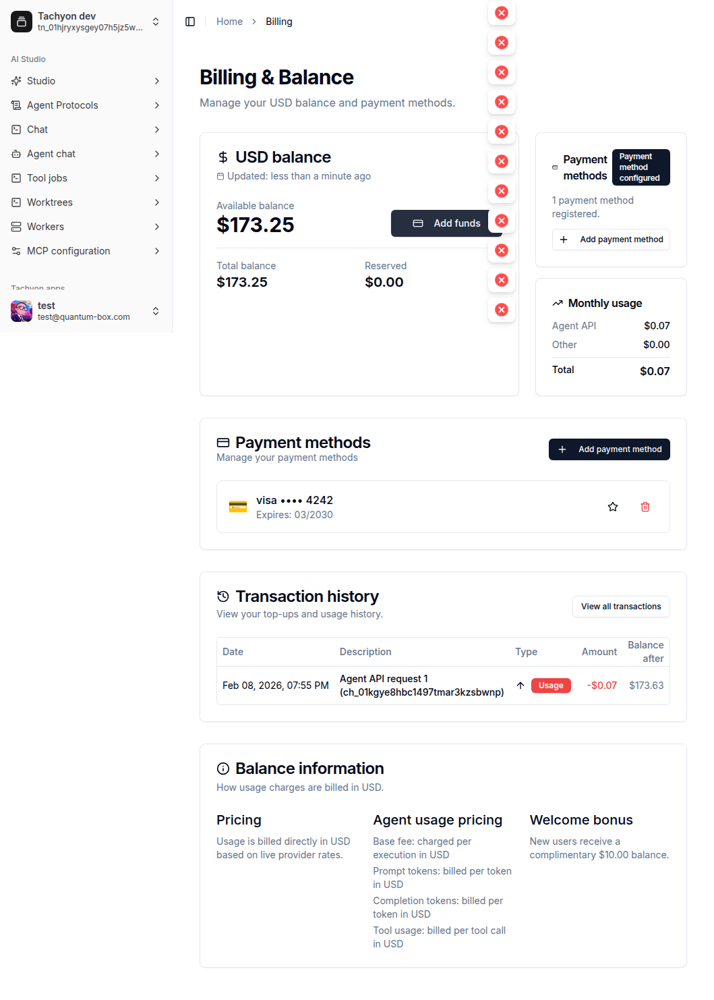

# Agent API課金の重大バグ修正

## 概要

Agent API の課金に3つの関連する重大問題を修正:

1. **キャッシュトークンが課金計算に含まれていない** → 実際のコストの99%が課金されない
2. **キャッシュ利用時に課金が完全にスキップされる** → 2回目以降のリクエストで課金処理自体が発生しない
3. **Billing画面のトランザクション履歴が表示されない** → ユーザーが課金状況を確認できない

## 背景・目的

### 根本原因: Anthropicのキャッシュの仕組み

- **1回目**: `prompt_tokens > 0`, `cache_creation > 0` → `total_tokens() > 0` → 課金される（ただし金額不足）
- **2回目以降**: `prompt_tokens ≈ 0`, `cache_read > 大量` → `total_tokens() == 0` → **課金が完全にスキップ**

2つのスキップ条件が存在:
- **L470**: `total_tokens() == 0` → billing skip（キャッシュのみリクエストがここでスキップ）
- **L486**: `selling_price == 0` → billing skip（prompt_tokensだけの売価がゼロに丸められた場合）

→ profit記録もスキップされるため「profitに反映されない」状態になっていた。

### トランザクション履歴の問題

`page.tsx` で `initialTransactions={null}` がハードコードされており、クライアントコンポーネントが直接APIにfetch → Docker環境でDNS/ネットワーク問題で失敗 → エラーが握りつぶされ空リスト表示。

## 実装内容

### Issue 1: キャッシュトークンが課金されない (Backend)

#### 1-1. `TokenUsage::total_tokens()` にキャッシュトークンを含める【最重要】

```rust
// BEFORE:
fn total_tokens(&self) -> usize {
    self.prompt_tokens + self.completion_tokens
}

// AFTER:
fn total_tokens(&self) -> usize {
    self.prompt_tokens
        + self.completion_tokens
        + self.cache_creation_input_tokens.unwrap_or(0)
        + self.cache_read_input_tokens.unwrap_or(0)
}
```

#### 1-2. `calculate_cost()` にキャッシュトークンをprompt_tokensに加算

```rust
let total_input_tokens = usage.tokens.prompt_tokens
    + usage.tokens.cache_creation_input_tokens.unwrap_or(0)
    + usage.tokens.cache_read_input_tokens.unwrap_or(0);
let usage_info = UsageInfo {
    executions: 1,
    prompt_tokens: total_input_tokens as i64,
    // ...
};
```

#### 1-3. ログ/メタデータにキャッシュトークン情報追加

billing metadataの`tokens`オブジェクトに `cache_creation`, `cache_read` を追加。

#### 1-4. テスト2件追加

- `test_cache_tokens_included_in_billing`: キャッシュトークンが売価計算に含まれることを検証
- `test_cache_only_request_not_skipped`: prompt_tokens=0 + cache_read=1000 でも課金がスキップされないことを検証

### Issue 2: トランザクション履歴が表示されない (Frontend)

#### 2-1. `page.tsx` でサーバーサイド初期データ取得

`Promise.all` に `sdk.CreditTransactions()` を追加し、SSRでデータを取得。

#### 2-2. `transaction-history.tsx` でProxy経由ページネーション

`getGraphqlSdk`（直接API接続）→ `getClientGraphqlEndpointUrl()`（Next.js proxy `/api/proxy/v1/graphql`）に変更。

## 影響範囲

- `UsageInfo`構造体、`ServiceCostCalculator`、GraphQL/RESTの型 → **変更不要**
- `calculate_cost_price`（原価計算）→ 既にキャッシュトークンを正しく処理済み → **変更不要**
- Profit記録 → Issue 1の修正で自動的に正しい値が記録される

## タスク分解

### フェーズ1: Backend修正 ✅

- [x] `TokenUsage::total_tokens()` にキャッシュトークン含める
- [x] `calculate_cost()` のprompt_tokensにキャッシュトークン加算
- [x] ログ/メタデータにキャッシュトークン情報追加
- [x] テスト2件追加

### フェーズ2: Frontend修正 ✅

- [x] `page.tsx` でサーバーサイドトランザクション取得
- [x] `transaction-history.tsx` をProxy経由に変更

### フェーズ3: 検証 ✅

- [x] `mise run check` パス（Rustコンパイル）
- [x] `yarn ts --filter=tachyon` パス（TypeScript型チェック）
- [x] Billing画面でトランザクション履歴が表示されることをブラウザ確認

## 動作確認

### Billing画面



- トランザクション履歴に「Agent API request 1」が正常表示
- 残高 $173.25、月次使用量 $0.07 が正しく表示

## 完了条件

- [x] キャッシュトークンが課金計算に含まれる
- [x] キャッシュのみリクエスト（prompt_tokens=0）でも課金がスキップされない
- [x] Billing画面でトランザクション履歴が正常表示される
- [x] 既存テストが全てパスする
- [x] 新規テスト2件がパスする
- [x] TypeScript型チェックがパスする
