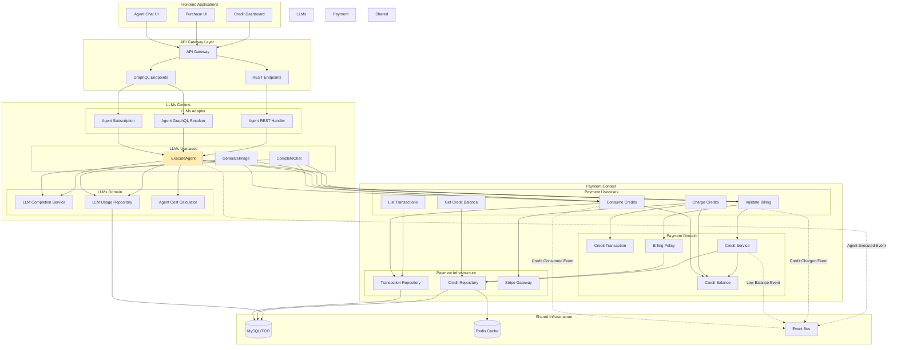

# Agent API向けクレジットチャージ式課金システムの実装

## 概要

Tachyon AppsのAgent APIに対して、クレジットチャージ式の使用量ベース課金システムを実装します。ユーザーは事前にクレジットを購入し、Agent API実行時にトークン数とツール使用に応じてクレジットを消費する仕組みです。

## 背景・目的

### なぜこのタスクが必要なのか
- Agent APIの商用化に向けて、使用量ベースの課金モデルが必要
- 現在の定額サブスクリプションモデルでは、ヘビーユーザーとライトユーザーの料金格差が不公平
- 前払い制により、キャッシュフローの改善と未払いリスクの回避

### 解決したい課題
- Agent API実行時の課金機能が未実装
- ツール使用（Web検索、コード実行等）のコスト管理ができない
- ユーザーが使用量を事前に把握・制御できない

### 期待される成果・メリット
- 使った分だけ支払う公平な課金システム
- クレジット残高による使用量の自己管理
- ツール使用を含めた詳細なコスト可視化
- ボーナスクレジットによる大口購入の促進

## 詳細仕様

### 機能要件

1. **クレジット管理**
   - クレジット残高のリアルタイム確認
   - クレジットパッケージの購入（Starter、Standard、Pro、Enterprise）
   - ボーナスクレジットの自動付与
   - クレジット取引履歴の記録

2. **Agent API課金**
   - API実行前のクレジット残高チェック
   - 実行中のクレジット予約機能
   - トークン使用量に基づく課金
   - ツール使用（Web検索、コード実行等）の追加課金

3. **コスト計算**
   - クレジットレート:
     - JPY: 1クレジット = ¥1
     - USD: 1クレジット = $0.01
   - ベースコスト: 10クレジット/実行
   - プロンプトトークン: 0.01クレジット/トークン
   - 完了トークン: 0.02クレジット/トークン
   - ツール使用料金（Web検索: 50クレジット、コード実行: 30クレジット等）

4. **決済処理**
   - Stripe Checkoutによるクレジット購入
   - 支払い成功時の自動クレジット付与
   - 購入履歴と領収書発行

5. **アラート機能**
   - 低残高警告（1000、500、100クレジット）
   - 実行失敗通知（クレジット不足）
   - 大量消費アラート

### 非機能要件

- **パフォーマンス**: 使用量記録が1秒以内に完了
- **可用性**: 99.9%以上のアップタイム
- **スケーラビリティ**: 月間10億トークンまで対応
- **セキュリティ**: 課金データの暗号化、監査ログ

## 実装方針

### アーキテクチャ設計（コンテキスト境界を含む）



### コンテキスト間の通信

```yaml
# コンテキスト間通信の定義
context_communication:
  # LLMs → Payment（同期）
  llms_to_payment:
    - interface: ValidateBilling
      operations:
        - execute
      description: "LLMsコンテキストが実行前に課金可能かチェック"
    
    - interface: ConsumeCredits
      operations:
        - execute
      description: "LLMsコンテキストが実行後にクレジット消費を記録"
    
  # Payment → LLMs（クエリ）
  payment_to_llms:
    - interface: UsageRepository
      operations:
        - find_by_execution_id
        - get_monthly_usage
      description: "Paymentコンテキストが使用量データを参照（将来の統計用）"
    
  # イベント駆動通信
  events:
    - name: AgentExecutedEvent
      producer: LLMs Context
      consumers: [Analytics Context, Audit Context]
      description: "Agent実行完了時の統計・監査用"
      
    - name: CreditConsumedEvent
      producer: Payment Context
      consumers: [Analytics Context]
      description: "クレジット消費の分析用"
      
    - name: CreditChargedEvent
      producer: Payment Context
      consumers: [Notification Context]
      description: "クレジット購入完了通知"
      
    - name: LowBalanceEvent
      producer: Payment Context
      consumers: [Notification Context]
      description: "低残高アラート通知"
      
    - name: InsufficientCreditsEvent
      producer: Payment Context
      consumers: [Notification Context, Analytics Context]
      description: "残高不足時の通知と分析"
```

### 技術選定とコンテキスト分離

#### コンテキスト別の責務

```yaml
contexts:
  llms:
    responsibilities:
      - "LLMプロバイダーとの通信"
      - "使用量の測定と記録"
      - "Agent/Chat実行ロジック"
      - "コスト見積もり計算"
    boundaries:
      - "課金の実行は行わない（Paymentに委譲）"
      - "クレジット残高の管理は行わない"
    
  payment:
    responsibilities:
      - "クレジット残高管理"
      - "取引履歴の記録"
      - "Stripe決済処理"
      - "課金ルールの実行"
    boundaries:
      - "LLM実行ロジックには関与しない"
      - "使用量データは参照のみ（所有しない）"
  
  order:
    responsibilities:
      - "注文処理"
      - "請求書生成"
      - "売上レポート"
    boundaries:
      - "クレジット購入注文の処理"
      - "月次請求書の生成（将来）"
```

#### 技術スタック
- **既存技術の活用**:
  - `packages/llms`: LLMコンテキストの実装
  - `packages/payment`: Paymentコンテキストの実装
  - `packages/order`: Orderコンテキストの実装（将来の請求書機能）
  
- **新規追加**:
  - Redis: クレジット残高のキャッシュ（Paymentコンテキスト）
  - EventBus: コンテキスト間の非同期通信
  - Bull/BullMQ: バッチ処理（日次集計）

### データモデル設計

```sql
-- クレジット残高
CREATE TABLE `credit_balances` (
    `tenant_id` VARCHAR(29) NOT NULL,
    `current_balance` BIGINT NOT NULL DEFAULT 0,
    `reserved_credits` BIGINT NOT NULL DEFAULT 0,
    `currency` ENUM('JPY', 'USD') NOT NULL DEFAULT 'JPY',
    `last_updated` TIMESTAMP NOT NULL,
    PRIMARY KEY (`tenant_id`)
);

-- クレジット取引履歴
CREATE TABLE `credit_transactions` (
    `id` VARCHAR(32) NOT NULL,
    `tenant_id` VARCHAR(29) NOT NULL,
    `transaction_type` ENUM('charge', 'usage', 'refund', 'adjustment') NOT NULL,
    `amount` BIGINT NOT NULL,
    `balance_after` BIGINT NOT NULL,
    `currency` ENUM('JPY', 'USD') NOT NULL,
    `exchange_rate` DECIMAL(10,4),  -- USDの場合の両替レート
    `amount_in_jpy` BIGINT,  -- 円換算額
    `description` TEXT NOT NULL,
    `metadata` JSON,
    `stripe_payment_intent_id` VARCHAR(255),
    `created_at` TIMESTAMP NOT NULL,
    PRIMARY KEY (`id`),
    INDEX idx_tenant_created (tenant_id, created_at)
);

-- クレジットパッケージ
CREATE TABLE `credit_packages` (
    `id` VARCHAR(32) NOT NULL,
    `name` VARCHAR(255) NOT NULL,
    `credits` BIGINT NOT NULL,
    `price_jpy` DECIMAL(10,2),  -- 円価格
    `price_usd` DECIMAL(10,2),  -- ドル価格
    `bonus_credits` BIGINT NOT NULL DEFAULT 0,
    `stripe_product_id` VARCHAR(255),
    `stripe_price_id_jpy` VARCHAR(255),  -- 円決済用
    `stripe_price_id_usd` VARCHAR(255),  -- ドル決済用
    `is_active` BOOLEAN DEFAULT true,
    `created_at` TIMESTAMP NOT NULL,
    PRIMARY KEY (`id`)
);

-- Agent実行コスト
CREATE TABLE `agent_execution_costs` (
    `id` VARCHAR(32) NOT NULL,
    `agent_execution_id` VARCHAR(32) NOT NULL,
    `tenant_id` VARCHAR(29) NOT NULL,
    `base_cost` BIGINT NOT NULL,
    `token_cost` BIGINT NOT NULL,
    `tool_cost` BIGINT NOT NULL,
    `total_cost` BIGINT NOT NULL,
    `tool_usage_details` JSON,
    `created_at` TIMESTAMP NOT NULL,
    PRIMARY KEY (`id`),
    UNIQUE KEY (`agent_execution_id`)
);
```
	
## 環境設定

### 必要な環境変数

```bash
# 課金機能の有効/無効
# development: false, staging/production: true
BILLING_ENABLED=false

# Stripe APIキー
# development: テストキーを使用
# staging: テストキーを使用
# production: 本番キーを使用
STRIPE_SECRET_KEY=sk_test_...
STRIPE_PUBLISHABLE_KEY=pk_test_...

# Stripe Webhookシークレット
# Stripeダッシュボードから取得
STRIPE_WEBHOOK_SECRET=whsec_...

# データベースURL
DATABASE_URL=mysql://root:@localhost:15000
```

### 環境ごとの設定

#### Development環境
```bash
BILLING_ENABLED=false  # NoOpPaymentAppを使用
# Stripeキーは設定不要
```

#### Staging環境
```bash
BILLING_ENABLED=true
STRIPE_SECRET_KEY=sk_test_51L1umOC0lHhtcjtrIhFsplKsLEGiXhb1YL...
STRIPE_PUBLISHABLE_KEY=pk_test_51L1umOC0lHhtcjtrKM3RKpGY...
STRIPE_WEBHOOK_SECRET=whsec_test_...
```

#### Production環境
```bash
BILLING_ENABLED=true
STRIPE_SECRET_KEY=sk_live_51L1umOC0lHhtcjtr...
STRIPE_PUBLISHABLE_KEY=pk_live_51L1umOC0lHhtcjtrcvouCnJuuelIhvAkUaXvV5asbu4ydtCRZJDtmBOsVGUF8GPrrLXXzzxnrKARMHnxYs5EJqEp004tFMNgXS
STRIPE_WEBHOOK_SECRET=whsec_...
```

## 動作確認手順

### 1. 環境準備

#### 必要なサービスの起動
```bash
# Dockerサービスの起動（MySQL、MinIOなど）
just up

# データベースマイグレーションの実行
just sqlx-migrate ./packages/payment
just sqlx-migrate ./packages/llms
```

#### 環境変数の設定
```bash
# .envファイルまたはシェルで設定
export BILLING_ENABLED=true  # 課金機能を有効化
export STRIPE_SECRET_KEY=sk_test_...  # Stripeテストキー
export STRIPE_PUBLISHABLE_KEY=pk_test_...  # Stripe公開可能キー
export STRIPE_WEBHOOK_SECRET=whsec_...  # Stripe Webhookシークレット
```

### 2. バックエンドの起動

```bash
# tachyon-apiサーバーの起動
cd apps/tachyon-api
cargo run

# または開発モードで起動（自動リロード付き）
bacon api -- tachyon-api
```

### 3. フロントエンドの起動

```bash
# 別のターミナルで
yarn dev --filter=tachyon
```

### 4. GraphQL APIの動作確認

#### GraphQL Playgroundへのアクセス
1. ブラウザで http://localhost:50054/v1/graphql を開く
2. ヘッダーに認証情報を設定：
   ```json
   {
     "x-tenant-id": "tn_01hjjn348rn3t49zz6hvmfq67p",
     "Authorization": "Bearer dummy-token"
   }
   ```

#### クレジット残高の確認
```graphql
query GetCreditBalance {
  creditBalance {
    balance
    reserved
    available
    currency
    lastUpdated
  }
}
```

#### クレジットパッケージ一覧の取得
```graphql
query GetCreditPackages {
  creditPackages(activeOnly: true) {
    id
    name
    credits
    bonusCredits
    totalCredits
    priceJpy
    priceUsd
    isActive
  }
}
```

#### 取引履歴の取得
```graphql
query GetCreditTransactions {
  creditTransactions(limit: 20, offset: 0) {
    nodes {
      id
      type
      amount
      balanceAfter
      description
      createdAt
      stripePaymentIntentId
      metadata
    }
    totalCount
    pageInfo {
      hasNextPage
      hasPreviousPage
      offset
      limit
    }
  }
}
```

### 5. UIの動作確認

#### ビリングページへのアクセス
1. http://localhost:16000/v1beta/tn_01hjjn348rn3t49zz6hvmfq67p/billing を開く
2. 認証が必要な場合はログイン
id: test
password: hmw2atd@HCF3qwu*rcn

#### 機能テスト
1. **残高表示**: クレジット残高が正しく表示されることを確認
2. **タブ切り替え**: 「概要」「クレジット購入」「取引履歴」「支払い方法」タブが動作
3. **URL同期**: タブ切り替え時にURLパラメーターが更新されることを確認

### 6. Stripe Checkoutのテスト

#### テスト用カード情報
```yaml
カード番号: 4242 4242 4242 4242
有効期限: 任意の将来の日付（例: 12/34）
CVC: 任意の3桁（例: 123）
郵便番号: 任意（例: 12345）
```

#### 購入フロー
1. 「クレジット購入」タブを選択
2. パッケージを選択
3. 「購入する」ボタンをクリック
4. Stripe Checkoutページにリダイレクトされることを確認
5. テストカード情報を入力
6. 成功ページにリダイレクトされることを確認

### 7. Stripe Webhookのテスト

#### ローカルでのWebhookテスト（Stripe CLI使用）
```bash
# Stripe CLIのインストール
brew install stripe/stripe-cli/stripe

# ログイン
stripe login

# Webhookイベントの転送
stripe listen --forward-to localhost:50054/v1/webhook/stripe

# 別のターミナルでテストイベントを送信
stripe trigger payment_intent.succeeded
```

### 8. Agent API課金のテスト

#### Agent実行時の課金確認
1. AIチャットページでAgentを実行
2. 実行後に残高が減少することを確認
3. 取引履歴にAgent実行の記録が追加されることを確認

### 9. エラーケースのテスト

#### 残高不足のテスト
1. 残高を0に設定（データベースで直接更新）
2. Agentを実行
3. 「INSUFFICIENT_CREDITS」エラーが表示されることを確認

#### 課金無効化のテスト
```bash
export BILLING_ENABLED=false
# サーバーを再起動
```
1. Agentが課金なしで実行できることを確認
2. ビリングページが正常に表示されることを確認

### 10. Storybookでのコンポーネントテスト

```bash
# Storybookの起動
yarn storybook --filter=tachyon

# ビルドとテスト
yarn build-storybook --filter=tachyon
yarn test-storybook:ci --filter=tachyon
```

### トラブルシューティング

#### データベース接続エラー
```bash
# MySQLが起動していることを確認
docker ps | grep mysql

# 接続テスト
mysql -h 127.0.0.1 -P 15000 -u root
```

#### GraphQL型エラー
```bash
# codegenを再実行
just codegen
```

#### Stripe関連エラー
- Stripeダッシュボードでテストモードになっていることを確認
- APIキーが正しく設定されていることを確認
- Webhookシークレットが正しいことを確認
STRIPE_SECRET_KEY=sk_live_51L1umOC0lHhtcjtr...
STRIPE_PUBLISHABLE_KEY=pk_live_51L1umOC0lHhtcjtrcvouCnJuuelIhvAkUaXvV5asbu4ydtCRZJDtmBOsVGUF8GPrrLXXzzxnrKARMHnxYs5EJqEp004tFMNgXS
STRIPE_WEBHOOK_SECRET=whsec_...
```

## タスク分解

### フェーズ1: クレジットシステム基盤 ✅
- [x] クレジット残高管理APIの実装
- [x] クレジット取引履歴の記録機能
- [x] クレジットダッシュボードUIの作成
- [x] GraphQLスキーマの拡張

### フェーズ2: Agent API課金統合 ✅
- [x] Agent実行コスト計算ロジック
- [x] クレジット消費ミドルウェアの実装
- [x] ツール使用料金の管理
- [x] 実行前のクレジット残高チェック

### フェーズ3: Stripe決済統合 ✅ (2025/01/14 完了)
- [x] クレジットパッケージのStripe商品作成
- [x] Checkout Sessionの実装
- [x] 支払い成功Webhookの処理
- [x] 購入履歴と領収書機能
- [x] 支払い方法管理機能（カード登録・削除）
- [x] Stripe Customer Balance API統合
- [x] 0.1クレジット精度の実装
- [x] Anthropicプロバイダーでの課金対応

### フェーズ4: 高度な機能 📝
- [ ] クレジット残高アラート
- [ ] 自動チャージ機能
- [ ] 使用量分析レポート
- [ ] チーム内クレジット配分

## テスト計画

### ユニットテスト
- 使用量集計ロジックのテスト
- 料金計算ロジックのテスト
- プラン変更時の日割り計算テスト

### 統合テスト
- Stripe APIとの連携テスト
- 使用量報告の正確性テスト
- 請求書生成プロセステスト

### E2Eテスト ✅ (2025-06-08 Playwright MCPで動作確認完了)
- ユーザーが使用量を確認できることの確認
- プラン変更フローのテスト
- 支払いフローのテスト

実装メモ：
- Playwright MCPを使用してBilling機能の動作確認を実施
- クレジット残高表示、タブ切り替え、Agent実行後の動作を確認
- 開発環境では課金機能が無効のため、実際のクレジット消費は発生しない
- 動作確認の手順は `/docs/src/for-developers/playwright-mcp-testing.md` に文書化

## リスクと対策

| リスク | 影響度 | 対策 |
|--------|--------|------|
| Stripe APIの障害 | 高 | リトライロジック、手動クレジット付与機能 |
| クレジット計算の誤り | 高 | 二重チェック機構、監査ログ、リアルタイム検証 |
| 同時実行での残高不整合 | 高 | 楽観的ロック、トランザクション管理 |
| ツール使用の急増 | 中 | 実行前の見積もり、上限設定 |
| クレジット不正利用 | 中 | 異常検知、使用量制限 |

## 実装の優先順位

1. **必須機能（MVP）**
   - クレジット残高管理API
   - Agent API実行時の残高チェック
   - 基本的なクレジット消費記録
   - 手動クレジット付与機能（管理者用）

2. **追加機能（Phase 2）**
   - Stripeによるクレジット購入
   - クレジットパッケージ管理
   - 使用履歴ダッシュボード
   - 低残高アラート

3. **高度な機能（Phase 3）**
   - 自動チャージ
   - チーム内クレジット配分
   - 詳細な使用量分析
   - コスト最適化提案

## 参考資料

- [LLM Agent Billing設計書](../../tachyon-apps/payment/llm-agent-billing.md)
- [Stripe Usage-based Billing Guide](https://stripe.com/docs/billing/subscriptions/usage-based)
- [OpenAI Pricing](https://openai.com/pricing)
- [Anthropic API Pricing](https://www.anthropic.com/api-pricing)
- 既存コード: `packages/llms`, `packages/payment`, `packages/order`

## 完了条件

- [x] クレジット管理APIが動作し、正確なデータを返す
- [x] Agent API実行時の課金チェックと消費記録が動作する
- [x] Stripeと連携したクレジット購入が動作する
- [x] UIから残高確認・購入・履歴確認が可能
- [x] 0.1クレジット単位での課金が正確に動作する
- [x] 1000円チャージで1000クレジットが正しく付与される
- [x] AnthropicプロバイダーでUsage情報が取得され課金される
- [ ] 使用量制限とアラートが適切に機能する（フェーズ4）
- [x] ドキュメントが最新化されている

## 実装メモ

### 2025/01/07 実装完了内容

#### フェーズ1: クレジットシステム基盤
1. **PaymentAppインターフェース** (`packages/tachyon_apps/src/payment/mod.rs`)
   - `check_billing`: 課金可能かチェック
   - `consume_credits`: クレジット消費
   - `get_credit_balance`: 残高取得
   - `charge_credits`: クレジットチャージ

2. **ドメインモデル** (`packages/payment/src/domain/`)
   - `CreditBalance`: 残高管理（現在残高、予約済み、利用可能）
   - `CreditTransaction`: 取引履歴
   - `BillingPolicy`: 課金ポリシー（課金有効/無効、無料トライアル、マイナス残高許可等）

3. **リポジトリ実装** (`packages/payment/src/adapter/gateway/`)
   - `SqlxCreditRepository`: クレジット残高のCRUD
   - `SqlxTransactionRepository`: 取引履歴の記録
   - `SqlxBillingPolicyRepository`: 課金ポリシー管理

4. **ユースケース** (`packages/payment/src/usecase/`)
   - `CheckBilling`: 実行可能性チェック
   - `ConsumeCredits`: クレジット消費（課金ポリシーに基づく）
   - `GetCreditBalance`: 残高照会
   - `ChargeCredits`: クレジット購入（Stripe統合準備）

5. **データベースマイグレーション**
   - `credit_balances`: クレジット残高テーブル
   - `credit_transactions`: 取引履歴テーブル
   - `credit_packages`: パッケージ定義テーブル
   - `billing_policies`: 課金ポリシーテーブル

#### フェーズ2: Agent API課金統合
1. **コスト計算** (`packages/llms/src/usecase/agent_cost_calculator.rs`)
   - 基本料金: 10クレジット/実行
   - プロンプトトークン: 0.01クレジット/トークン
   - 完了トークン: 0.02クレジット/トークン
   - ツール使用料金（Web検索: 50、コード実行: 30等）

2. **ExecuteAgent統合** (`packages/llms/src/usecase/execute_agent.rs`)
   - PaymentAppを必須依存として受け取る
   - 実行前: `check_billing`で残高チェック
   - 実行後: ストリーム処理内で`consume_credits`実行
   - トークン使用量とツール使用の追跡

3. **Agent実行コスト記録** (`packages/llms/domain/src/agent_execution_cost.rs`)
   - 実行ごとのコスト詳細を記録
   - ツール使用の内訳をJSON形式で保存

4. **NoOpPaymentApp実装** (`packages/tachyon_apps/src/payment/noop.rs`)
   - 開発環境用の課金無効実装
   - 常に実行可能を返す
   - クレジット消費をスキップ

5. **アプリケーション統合**
   - `tachyon-api`: NoOpPaymentAppを使用（本番実装は今後）
   - `stockmind`: 同様にNoOpPaymentAppを使用
   - `lambda`: 同様の対応

### 実装上の工夫点
1. **Clean Architecture準拠**
   - 1 usecase 1 public method原則を厳守
   - 依存性の向きを正しく維持（LLMs → Payment）
   
2. **柔軟な課金制御**
   - BillingPolicyでテナントごとの課金ルールを管理
   - 内部ユーザー向けの課金スキップオプション
   - 月間制限やマイナス残高許可の設定

3. **ストリーミング対応**
   - Agent実行のストリーム内で使用量を追跡
   - ストリーム終了時に一括で課金処理
   - エラー時も適切にハンドリング

#### フェーズ3: Stripe決済統合（2025/01/14完了）
1. **クレジットパッケージドメイン** (`packages/payment/src/domain/credit_package.rs`)
   - 4つのプリセットパッケージ（Starter、Standard、Pro、Enterprise）
   - ボーナスクレジット（10%〜30%）の自動計算
   - 通貨別価格設定（JPY/USD）

2. **Stripe統合ユースケース** (`packages/payment/src/usecase/`)
   - `CreateCheckoutSession`: Stripe Checkout Session作成
   - `HandleStripeWebhook`: Webhook処理とクレジット付与
   - `ListCreditPackages`: パッケージ一覧取得
   - `CreateStripeProducts`: Stripe商品初期作成（管理者用）

3. **PaymentAppインターフェース拡張** (`packages/tachyon_apps/src/payment/mod.rs`)
   ```rust
   async fn create_checkout_session(...) -> CheckoutSessionOutput;
   async fn handle_stripe_webhook(...) -> WebhookOutput;
   async fn list_credit_packages(...) -> Vec<CreditPackageInfo>;
   ```

4. **データベース拡張**
   - `credit_packages`テーブル: パッケージ定義とStripe ID管理
   - プリセットデータの自動挿入

5. **GraphQLスキーマ定義** (`packages/payment/schema.graphql`)
   - `Query`: creditBalance、creditTransactions、creditPackages
   - `Mutation`: createCreditPurchaseSession、grantCredits（管理者用）
   - 型定義: CreditBalance、CreditTransaction、CreditPackage等

6. **tachyon-apiへのWebhook統合** (`apps/tachyon-api/src/stripe_webhook.rs`)
   - `/v1/webhook/stripe`エンドポイントの追加
   - Stripe署名検証
   - PaymentAppへの処理委譲
   - エラー時も200を返してStripeの再送を防ぐ

7. **Payment context GraphQL Resolver実装** (2025/01/07完了)
   - `PaymentQuery`: creditBalance、creditTransactions、creditPackages
   - `PaymentMutation`: createCreditPurchaseSession、grantCredits
   - PaymentAppインターフェースにget_credit_transactions、grant_creditsメソッド追加
   - tachyon-apiのGraphQLスキーマにPaymentAppを統合

### 未実装項目（今後の課題）
1. **tachyon-apiへの統合**
   - ✅ Stripe Webhookエンドポイントの追加（`/v1/webhook/stripe`）
   - ✅ Payment context GraphQL Resolverの統合
   - PaymentApp実装の本番環境への切り替え（現在はNoOpPaymentApp）

2. **UI実装** ✅（2025/01/07完了）
   - apps/tachyon/src/app/v1beta/[tenant_id]/billing/
     - `page.tsx`: メイン課金管理ページ（タブ切り替えUI）
     - `credit-balance-card.tsx`: クレジット残高表示コンポーネント
     - `credit-package-selector.tsx`: パッケージ選択・購入UI
     - `transaction-history.tsx`: 取引履歴表示（ページング対応）
     - `success/page.tsx`: Stripe決済成功ページ（紙吹雪アニメーション付き）
   - GraphQLクエリ/ミューテーション実装済み
   - 環境変数による課金有効/無効の切り替え対応
   - Storybookストーリー実装済み（全コンポーネント）
     - MockedProviderによるGraphQLモック
     - インタラクションテスト（Play関数）
     - 各種状態のバリエーション（Loading、Empty、Error等）

3. **高度な機能**
   - 低残高アラート通知
   - 自動チャージ（残高が閾値以下で自動購入）
   - 使用量分析ダッシュボード
   - チーム内クレジット配分機能

4. **運用機能**
   - Stripe商品の自動同期
   - 返金処理
   - 月次レポート生成
   - 使用量予測と最適化提案

## 実装メモ

### クレジット管理の考慮事項
- クレジットレート:
  - JPY: 1クレジット = ¥1
  - USD: 1クレジット = $0.01
- クレジットの有効期限は設けない（永続的に利用可能）
- 最小購入単位:
  - JPY: 1,000クレジット（¥1,000）
  - USD: 1,000クレジット（$10）
- ボーナスクレジットは通常クレジットと同じ扱い
- 通貨変換: テナント設定時に選択した通貨で固定

### Agent API統合のポイント
- `/v1/llms/chatrooms/{chatroom_id}/agent/execute`エンドポイントでのクレジットチェック
- CommandStack実行時のツール使用記録
- ストリーミングレスポンスでの途中キャンセル対応
- エラー時のクレジットロールバック

### パフォーマンス最適化
- クレジット残高はRedisでキャッシュ（TTL: 5分）
- 予約クレジットは実行完了まで保持（最大30分）
- バッチでのクレジット消費記録（1秒ごと）

### セキュリティ
- クレジット付与は管理者権限必須
- 異常な消費パターンの自動検知
- APIレート制限との連携

## Agent API実装イメージ

### 1. クレジット管理ドメイン

```rust
// packages/payment/src/domain/credit.rs
use ulid::Ulid;
use chrono::{DateTime, Utc};

#[derive(Debug, Clone)]
pub struct CreditBalance {
    pub tenant_id: TenantId,
    pub balance: i64,
    pub reserved: i64,
    pub currency: Currency,
    pub updated_at: DateTime<Utc>,
}

impl CreditBalance {
    pub fn available(&self) -> i64 {
        self.balance - self.reserved
    }
    
    pub fn can_afford(&self, cost: i64) -> bool {
        self.available() >= cost
    }
    
    pub fn reserve(&mut self, amount: i64) -> Result<(), CreditError> {
        if !self.can_afford(amount) {
            return Err(CreditError::InsufficientCredits);
        }
        self.reserved += amount;
        self.updated_at = Utc::now();
        Ok(())
    }
    
    pub fn consume(&mut self, amount: i64) -> Result<(), CreditError> {
        if amount > self.reserved {
            return Err(CreditError::InvalidReservation);
        }
        self.balance -= amount;
        self.reserved -= amount;
        self.updated_at = Utc::now();
        Ok(())
    }
}

#[derive(Debug, Clone)]
pub struct CreditTransaction {
    pub id: Ulid,
    pub tenant_id: TenantId,
    pub transaction_type: TransactionType,
    pub amount: i64,
    pub balance_after: i64,
    pub currency: Currency,
    pub description: String,
    pub metadata: serde_json::Value,
    pub created_at: DateTime<Utc>,
}

#[derive(Debug, Clone)]
pub enum TransactionType {
    Charge,      // クレジット購入
    Usage,       // API使用
    Refund,      // 返金
    Adjustment,  // 調整
}
```

### 2. コスト計算サービス

```rust
// packages/llms/domain/src/service/cost_calculator.rs
use crate::{llm_usage::LlmUsage, service::tool::ToolExecution};
use std::collections::HashMap;

pub struct AgentCostCalculator {
    base_cost: i64,
    prompt_token_rate: f64,
    completion_token_rate: f64,
    tool_costs: HashMap<String, i64>,
}

impl AgentCostCalculator {
    pub fn new() -> Self {
        Self {
            base_cost: 10,  // 基本料金: 10クレジット
            prompt_token_rate: 0.01,
            completion_token_rate: 0.02,
            tool_costs: HashMap::from([
                // MCPツールのコスト設定
                ("mcp_search".to_string(), 50),
                ("mcp_read".to_string(), 20),
                ("mcp_write".to_string(), 30),
                ("mcp_exec".to_string(), 40),
                // 一般的なツール
                ("web_search".to_string(), 50),
                ("code_execution".to_string(), 30),
                ("file_operation".to_string(), 20),
            ]),
        }
    }
    
    pub fn estimate_cost(
        &self,
        task_length: usize,
        has_mcp_config: bool,
    ) -> i64 {
        // タスクの長さから大まかなトークン数を推定
        let estimated_tokens = (task_length / 4) as i64 * 10;
        let token_cost = (estimated_tokens as f64 * self.prompt_token_rate) as i64;
        
        // MCPサーバーがある場合は平均的なツール使用を見込む
        let tool_cost = if has_mcp_config { 100 } else { 0 };
        
        self.base_cost + token_cost + tool_cost
    }
    
    pub fn calculate_from_stream(
        &self,
        usage_tokens: u32,
        completion_tokens: u32,
        tool_calls: Vec<String>,
    ) -> AgentExecutionCost {
        let token_cost = 
            (usage_tokens as f64 * self.prompt_token_rate) as i64 +
            (completion_tokens as f64 * self.completion_token_rate) as i64;
        
        // ツール使用のカウント
        let mut tool_usage_map: HashMap<String, u32> = HashMap::new();
        for tool in tool_calls {
            *tool_usage_map.entry(tool).or_insert(0) += 1;
        }
        
        let tool_costs: Vec<ToolUsageCost> = tool_usage_map
            .into_iter()
            .map(|(tool_name, count)| {
                let cost_per_use = self.tool_costs.get(&tool_name).unwrap_or(&10);
                ToolUsageCost {
                    tool_name,
                    usage_count: count,
                    cost_per_use: *cost_per_use,
                    total_cost: *cost_per_use * count as i64,
                }
            })
            .collect();
        
        let total_tool_cost: i64 = tool_costs.iter().map(|t| t.total_cost).sum();
        
        AgentExecutionCost {
            base_cost: self.base_cost,
            token_cost,
            tool_costs,
            total_cost: self.base_cost + token_cost + total_tool_cost,
        }
    }
}

#[derive(Debug)]
pub struct AgentExecutionCost {
    pub base_cost: i64,
    pub token_cost: i64,
    pub tool_costs: Vec<ToolUsageCost>,
    pub total_cost: i64,
}

#[derive(Debug)]
pub struct ToolUsageCost {
    pub tool_name: String,
    pub usage_count: u32,
    pub cost_per_use: i64,
    pub total_cost: i64,
}
```

### 3. 課金ポリシーとバリデーション（Paymentコンテキスト）

```rust
// packages/payment/src/domain/billing_policy.rs
use crate::domain::{CreditBalance, TenantId};

/// 課金ポリシー - テナントごとの課金ルールを管理
#[derive(Debug, Clone)]
pub struct BillingPolicy {
    pub tenant_id: TenantId,
    pub is_billing_enabled: bool,
    pub free_trial_credits: Option<i64>,
    pub allow_negative_balance: bool,
    pub skip_billing_for_internal: bool,
    pub monthly_credit_limit: Option<i64>,
}

impl BillingPolicy {
    /// 課金が必要かどうかを判定
    pub fn requires_billing(&self) -> bool {
        self.is_billing_enabled
    }
    
    /// 実行可能かどうかを判定（残高と課金ポリシーを考慮）
    pub fn can_execute(
        &self,
        balance: &CreditBalance,
        estimated_cost: i64,
    ) -> Result<(), BillingError> {
        // 課金が無効化されている場合は常に実行可能
        if !self.is_billing_enabled {
            return Ok(());
        }
        
        // 内部ユーザーで課金スキップが有効な場合
        if self.skip_billing_for_internal {
            return Ok(());
        }
        
        // 残高チェック
        let available = balance.available();
        if available < estimated_cost && !self.allow_negative_balance {
            return Err(BillingError::InsufficientCredits {
                required: estimated_cost,
                available,
            });
        }
        
        // 月間制限チェック
        if let Some(limit) = self.monthly_credit_limit {
            let monthly_usage = balance.monthly_usage;
            if monthly_usage + estimated_cost > limit {
                return Err(BillingError::MonthlyLimitExceeded {
                    limit,
                    current_usage: monthly_usage,
                });
            }
        }
        
        Ok(())
    }
}

// packages/payment/src/usecase/check_billing.rs

/// 課金チェックユースケース（実際のPaymentApp実装内で使用）
pub struct CheckBillingUseCase {
    credit_repository: Arc<dyn CreditRepository>,
    policy_repository: Arc<dyn BillingPolicyRepository>,
}

impl CheckBillingUseCase {
    pub async fn execute(
        &self,
        tenant_id: &TenantId,
        estimated_cost: i64,
        resource_type: &str,
    ) -> Result<(), PaymentError> {
        // テナントの課金ポリシーを取得
        let policy = self.policy_repository
            .get_or_default(tenant_id.clone())
            .await?;
        
        // 課金が無効化されている場合は即座にOKを返す
        if !policy.requires_billing() {
            return Ok(());
        }
        
        // クレジット残高を取得
        let balance = self.credit_repository
            .get_or_create(tenant_id.clone())
            .await?;
        
        // 実行可能かチェック
        policy.can_execute(&balance, estimated_cost)?;
        
        Ok(())
    }
}

// packages/payment/src/app.rs
// PaymentApp実装内でCheckBillingUseCaseを使用
#[async_trait::async_trait]
impl PaymentApp for PaymentAppImpl {
    async fn check_billing<'a>(
        &self,
        input: &CheckBillingInput<'a>,
    ) -> errors::Result<()> {
        let tenant_id = input.multi_tenancy.get_tenant_id()
            .ok_or_else(|| errors::Error::unauthorized("Tenant ID required for billing"))?;
        
        self.check_billing_usecase
            .execute(&tenant_id, input.estimated_cost, input.resource_type)
            .await
            .map_err(|e| match e {
                PaymentError::InsufficientCredits { required, available } => {
                    errors::Error::payment_required(format!(
                        "Insufficient credits. Required: {}, Available: {}",
                        required, available
                    ))
                }
                PaymentError::MonthlyLimitExceeded { limit, current_usage } => {
                    errors::Error::payment_required(format!(
                        "Monthly credit limit exceeded. Limit: {}, Current usage: {}",
                        limit, current_usage
                    ))
                }
                _ => errors::Error::internal_server_error(e.to_string()),
            })?;
        
        Ok(())
    }
}
```

### 4. PaymentAppインターフェース定義

```rust
// packages/tachyon_apps/src/payment/mod.rs
use auth_domain::{ExecutorAction, MultiTenancyAction};
use value_object::TenantId;

/// PaymentApp interface
/// 
/// 課金に関する操作を提供する統一インターフェース
#[async_trait::async_trait]
#[cfg_attr(feature = "test", mockall::automock)]
pub trait PaymentApp: Debug + Send + Sync + 'static {
    /// 課金可能かチェックする
    /// 課金不可の場合はエラーを返す（AuthApp::check_policyと同じパターン）
    async fn check_billing<'a>(
        &self,
        input: &CheckBillingInput<'a>,
    ) -> errors::Result<()>;
    
    /// クレジットを消費する
    async fn consume_credits<'a>(
        &self,
        input: &ConsumeCreditsInput<'a>,
    ) -> errors::Result<ConsumeCreditsOutput>;
    
    /// クレジット残高を取得する
    async fn get_credit_balance<'a>(
        &self,
        input: &GetCreditBalanceInput<'a>,
    ) -> errors::Result<CreditBalance>;
    
    /// クレジットをチャージする
    async fn charge_credits<'a>(
        &self,
        input: &ChargeCreditsInput<'a>,
    ) -> errors::Result<ChargeCreditsOutput>;
}

#[derive(Debug, Clone)]
pub struct CheckBillingInput<'a> {
    pub executor: &'a dyn ExecutorAction,
    pub multi_tenancy: &'a dyn MultiTenancyAction,
    pub estimated_cost: i64,
    pub resource_type: &'static str, // "agent_execution", "chat_completion", etc.
}

#[derive(Debug, Clone)]
pub struct ConsumeCreditsInput<'a> {
    pub executor: &'a dyn ExecutorAction,
    pub multi_tenancy: &'a dyn MultiTenancyAction,
    pub amount: i64,
    pub resource_type: &'static str,
    pub resource_id: String,
    pub description: String,
    pub metadata: serde_json::Value,
}

#[derive(Debug, Clone)]
pub struct ConsumeCreditsOutput {
    pub transaction_id: Option<String>,
    pub amount_consumed: i64,
    pub balance_after: i64,
    pub was_billed: bool,
}

#[derive(Debug, Clone)]
pub struct GetCreditBalanceInput<'a> {
    pub executor: &'a dyn ExecutorAction,
    pub multi_tenancy: &'a dyn MultiTenancyAction,
}

#[derive(Debug, Clone)]
pub struct CreditBalance {
    pub balance: i64,
    pub reserved: i64,
    pub available: i64,
    pub currency: String,
    pub last_updated: chrono::DateTime<chrono::Utc>,
}

#[derive(Debug, Clone)]
pub struct ChargeCreditsInput<'a> {
    pub executor: &'a dyn ExecutorAction,
    pub multi_tenancy: &'a dyn MultiTenancyAction,
    pub package_id: String,
    pub payment_method: String,
}

#[derive(Debug, Clone)]
pub struct ChargeCreditsOutput {
    pub checkout_url: String,
    pub session_id: String,
}
```

### 5. 更新版ExecuteAgentユースケース（PaymentApp統合）

```rust
// packages/llms/src/usecase/execute_agent.rs
use packages::tachyon_apps::payment::PaymentApp;
use packages::llms::domain::service::cost_calculator::AgentCostCalculator;

/// Agent実行ユースケース（PaymentApp統合版）
#[derive(Debug)]
pub struct ExecuteAgent {
    chat_stream_providers: Arc<ChatStreamProviders>,
    chat_message_repo: Arc<dyn ChatMessageRepository>,
    cost_calculator: Arc<AgentCostCalculator>,
    payment_app: Arc<dyn PaymentApp>, // 必須で課金を統合
}

impl ExecuteAgentInputPort for ExecuteAgent {
    /// 唯一のpublicメソッド
    async fn execute<'a>(
        &self,
        input: ExecuteAgentInputData<'a>,
    ) -> Result<ChatStreamResponse> {
        // ユーザーIDを取得
        let user_id = UserId::from_str(input.executor.get_id())
            .map_err(|_| errors::Error::type_error("Invalid user ID format"))?;
        
        // コスト見積もり
        let estimated_cost = self.cost_calculator.estimate_cost(
            input.task.len(),
            input.mcp_hub_config_json.is_some(),
        );
        
        // 課金チェック（課金不可の場合はエラーが返される）
        self.payment_app.check_billing(&CheckBillingInput {
            executor: input.executor,
            multi_tenancy: input.multi_tenancy,
            estimated_cost,
            resource_type: "agent_execution",
        }).await?;
        
        // MCP Hubの設定（オプション）
        let mcp_hub = match input.mcp_hub_config_json {
            Some(json_str) => {
                let workspace_path = PathBuf::from("packages/llms/examples/workspace");
                match McpHub::new_from_json(workspace_path.clone(), json_str.as_str()).await {
                    Ok(hub) => {
                        hub.connect_all_servers().await?;
                        Some(hub)
                    }
                    Err(e) => return Err(errors::Error::internal_server_error(
                        format!("Failed to create McpHub: {}", e)
                    )),
                }
            }
            None => None,
        };
        
        // プロバイダーの選択
        let selected_provider = self.select_provider(&input.model);
        
        // Agent実行ID生成（トラッキング用）
        let execution_id = Ulid::new().to_string();
        
        // CommandStackを使用してAgentを実行
        let command_stack = CommandStack::start_new_task(
            Arc::new(AttemptApiRequest::new(
                selected_provider,
                mcp_hub.clone().map(Arc::new),
            )),
            self.chat_message_repo.clone(),
            &input.task,
            input.auto_approve,
            input.max_requests,
            input.chatroom_id,
            user_id,
            input.user_custom_instructions,
            input.assistant_name.as_deref(),
            input.additional_tool_description.as_deref(),
            input.model.clone(),
            mcp_hub,
        ).await;
        
        // CommandStackを実行
        let mut stream = command_stack.handle().await?;
        
        // ストリームをラップして使用量をトラッキング
        let (tx, rx) = tokio::sync::mpsc::channel(100);
        let cost_calculator = self.cost_calculator.clone();
        let payment_app = self.payment_app.clone();
        let executor = input.executor.clone();
        let multi_tenancy = input.multi_tenancy.clone();
        let execution_id_clone = execution_id.clone();
        let model = input.model.clone();
        
        // ストリーム処理タスク
        tokio::spawn(async move {
            let mut total_tokens = 0u32;
            let mut completion_tokens = 0u32;
            let mut tool_calls = Vec::new();
            
            while let Some(chunk_result) = stream.next().await {
                match chunk_result {
                    Ok(chunk) => {
                        // 使用量情報を抽出
                        match &chunk {
                            StreamChunk::Usage(usage) => {
                                total_tokens = usage.prompt_tokens + usage.completion_tokens;
                                completion_tokens = usage.completion_tokens;
                            }
                            StreamChunk::ToolCall(tool_call) => {
                                tool_calls.push(tool_call.name.clone());
                            }
                            _ => {}
                        }
                        
                        // チャンクを転送
                        if tx.send(Ok(chunk)).await.is_err() {
                            break;
                        }
                    }
                    Err(e) => {
                        let _ = tx.send(Err(e)).await;
                        break;
                    }
                }
            }
            
            // ストリーム完了後にコスト計算と課金
            let actual_cost = cost_calculator.calculate_from_stream(
                total_tokens - completion_tokens,
                completion_tokens,
                tool_calls,
            );
            
            // クレジット消費（PaymentApp内で課金有効/無効を判定）
            let _ = payment_app.consume_credits(&ConsumeCreditsInput {
                executor: &executor,
                multi_tenancy: &multi_tenancy,
                amount: actual_cost.total_cost,
                resource_type: "agent_execution",
                resource_id: execution_id_clone.clone(),
                description: format!("Agent execution: {}", execution_id_clone),
                metadata: serde_json::json!({
                    "execution_id": execution_id_clone,
                    "base_cost": actual_cost.base_cost,
                    "token_cost": actual_cost.token_cost,
                    "tool_costs": actual_cost.tool_costs,
                    "model": model,
                }),
            }).await;
        });
        
        Ok(ReceiverStream::new(rx))
    }
}
```

### 5. ConsumeCreditsユースケース（課金ポリシーチェック付き）

```rust
// packages/payment/src/usecase/consume_credits.rs

/// クレジット消費ユースケース（課金ポリシーチェック付き）
pub struct ConsumeCredits {
    credit_repository: Arc<dyn CreditRepository>,
    transaction_repository: Arc<dyn TransactionRepository>,
    policy_repository: Arc<dyn BillingPolicyRepository>,
    event_publisher: Arc<dyn EventPublisher>,
}

impl ConsumeCredits {
    pub async fn execute(
        &self,
        input: ConsumeCreditsInput,
    ) -> Result<ConsumeCreditsOutput, PaymentError> {
        // テナントの課金ポリシーを取得
        let policy = self.policy_repository
            .get_or_default(input.tenant_id.clone())
            .await?;
        
        // 課金が無効化されている場合はスキップ
        if !policy.requires_billing() {
            return Ok(ConsumeCreditsOutput {
                transaction_id: None,
                amount_consumed: 0,
                balance_after: 0,
                was_billed: false,
            });
        }
        
        // クレジット残高を取得
        let mut balance = self.credit_repository
            .get_or_create(input.tenant_id.clone())
            .await?;
        
        // マイナス残高を許可するかチェック
        if balance.available() < input.amount && !policy.allow_negative_balance {
            // 残高不足でもエラーにはしない（すでに実行済みのため）
            // ただし、イベントは発行する
            self.event_publisher.publish(InsufficientCreditsEvent {
                tenant_id: input.tenant_id.clone(),
                attempted_amount: input.amount,
                available_amount: balance.available(),
                resource_type: input.resource_type,
                resource_id: input.resource_id,
                timestamp: Utc::now(),
            }).await;
            
            return Ok(ConsumeCreditsOutput {
                transaction_id: None,
                amount_consumed: 0,
                balance_after: balance.balance,
                was_billed: false,
            });
        }
        
        // クレジットを消費
        balance.balance -= input.amount;
        balance.monthly_usage += input.amount;
        self.credit_repository.save(&balance).await?;
        
        // トランザクションを記録
        let transaction = CreditTransaction {
            id: Ulid::new(),
            tenant_id: input.tenant_id.clone(),
            transaction_type: TransactionType::Usage,
            amount: -input.amount,
            balance_after: balance.balance,
            currency: balance.currency,
            description: input.description,
            metadata: input.metadata,
            resource_type: Some(input.resource_type.clone()),
            resource_id: Some(input.resource_id.clone()),
            created_at: Utc::now(),
        };
        
        self.transaction_repository.save(&transaction).await?;
        
        // 低残高アラートチェック
        if balance.balance < 1000 && balance.balance + input.amount >= 1000 {
            self.event_publisher.publish(LowBalanceEvent {
                tenant_id: input.tenant_id,
                current_balance: balance.balance,
                threshold: 1000,
                timestamp: Utc::now(),
            }).await;
        }
        
        // クレジット消費イベント発行
        self.event_publisher.publish(CreditConsumedEvent {
            tenant_id: input.tenant_id,
            transaction_id: transaction.id,
            amount: input.amount,
            balance_after: balance.balance,
            resource_type: input.resource_type,
            resource_id: input.resource_id,
            timestamp: Utc::now(),
        }).await;
        
        Ok(ConsumeCreditsOutput {
            transaction_id: Some(transaction.id),
            amount_consumed: input.amount,
            balance_after: balance.balance,
            was_billed: true,
        })
    }
}

#[derive(Debug)]
pub struct ConsumeCreditsInput {
    pub tenant_id: TenantId,
    pub amount: i64,
    pub resource_type: String,  // "agent_execution", "chat_completion", etc.
    pub resource_id: String,     // 実行IDなど
    pub description: String,
    pub metadata: serde_json::Value,
}

#[derive(Debug)]
pub struct ConsumeCreditsOutput {
    pub transaction_id: Option<Ulid>,
    pub amount_consumed: i64,
    pub balance_after: i64,
    pub was_billed: bool,  // 課金が実際に行われたか
}
```

### 6. GraphQL Subscription実装（LLMsコンテキスト）

```rust
// packages/llms/src/adapter/graphql/agent_subscription.rs
use async_graphql::{Context, Object, Subscription, Result, SimpleObject};
use futures_util::stream::Stream;
use std::pin::Pin;
use crate::usecase::execute_agent::{ExecuteAgent, ExecuteAgentInputData};
use packages::llms::domain::chat_room::ChatRoomId;

#[derive(SimpleObject)]
pub struct AgentExecutionEvent {
    pub event_type: String,
    pub data: serde_json::Value,
    pub timestamp: i64,
    pub execution_id: String,
    pub credits_consumed: Option<i64>,
}

#[derive(Default)]
pub struct AgentSubscription;

#[Subscription]
impl AgentSubscription {
    /// Agent実行のストリーミングサブスクリプション
    async fn execute_agent(
        &self,
        ctx: &Context<'_>,
        chatroom_id: String,
        task: String,
        model: Option<String>,
        auto_approve: Option<bool>,
        max_requests: Option<i32>,
        mcp_hub_config_json: Option<String>,
        user_custom_instructions: Option<String>,
        assistant_name: Option<String>,
        additional_tool_description: Option<String>,
    ) -> Result<Pin<Box<dyn Stream<Item = AgentExecutionEvent> + Send>>> {
        let llms_app = ctx.data::<Arc<crate::App>>()?;
        let executor = ctx.data::<Executor>()?;
        let multi_tenancy = ctx.data::<MultiTenancy>()?;
        
        // 入力データの準備
        let input_data = ExecuteAgentInputData {
            executor,
            multi_tenancy,
            chatroom_id: ChatRoomId::from_str(&chatroom_id)?,
            task,
            user_custom_instructions,
            assistant_name,
            additional_tool_description,
            auto_approve: auto_approve.unwrap_or(false),
            max_requests: max_requests.unwrap_or(10) as usize,
            mcp_hub_config_json,
            model,
        };
        
        // Agent実行（課金処理はユースケース内で実施）
        let stream_response = llms_app
            .execute_agent()
            .execute(input_data)
            .await?;
        
        let execution_id = Ulid::new().to_string();
        
        // ストリームをGraphQLイベントに変換
        let event_stream = stream_response
            .map(move |chunk_result| {
                match chunk_result {
                    Ok(chunk) => {
                        let event_type = chunk.event_name().to_string();
                        let data = serde_json::to_value(&chunk).unwrap_or(serde_json::Value::Null);
                        
                        // 完了時にコスト情報を含める（将来的な拡張）
                        let credits_consumed = if matches!(chunk, StreamChunk::Done(_)) {
                            // ストリーム完了時に実際の消費クレジットを取得
                            // TODO: イベントバスから取得する仕組みを実装
                            None
                        } else {
                            None
                        };
                        
                        AgentExecutionEvent {
                            event_type,
                            data,
                            timestamp: chrono::Utc::now().timestamp_millis(),
                            execution_id: execution_id.clone(),
                            credits_consumed,
                        }
                    }
                    Err(e) => AgentExecutionEvent {
                        event_type: "error".to_string(),
                        data: serde_json::json!({
                            "error": e.to_string(),
                            "code": match &e {
                                errors::Error::PaymentRequired(_) => "INSUFFICIENT_CREDITS",
                                _ => "EXECUTION_ERROR"
                            }
                        }),
                        timestamp: chrono::Utc::now().timestamp_millis(),
                        execution_id: execution_id.clone(),
                        credits_consumed: None,
                    }
                }
            });
        
        Ok(Box::pin(event_stream))
    }
}
```

### 7. GraphQL Resolver実装（Paymentコンテキスト）

**重要**: CLAUDE.mdのLLMビリング実装ルールに基づき、クレジット関連のGraphQLはPaymentコンテキストのPaymentQuery、PaymentMutationに追加します。

```rust
// packages/payment/src/adapter/graphql/payment_resolver.rs
use async_graphql::{Context, Object, Result, SimpleObject};
use crate::usecase::{GetCreditBalance, GetCreditBalanceInput};
use crate::usecase::{ListTransactions, ListTransactionsInput};
use crate::usecase::{ListPackages, ListPackagesInput};
use crate::usecase::{CreateCheckout, CreateCheckoutInput};
use crate::usecase::{GrantCredits, GrantCreditsInput};
use packages::core::MultiTenancy;
use crate::domain::TenantId;

#[derive(SimpleObject)]
pub struct CreditBalance {
    pub balance: i64,
    pub reserved: i64,
    pub available: i64,
    pub currency: String,
    pub last_updated: i64,
}

#[derive(SimpleObject)]
pub struct CreditTransaction {
    pub id: String,
    pub transaction_type: String,
    pub amount: i64,
    pub balance_after: i64,
    pub currency: String,
    pub description: String,
    pub metadata: serde_json::Value,
    pub created_at: i64,
}

#[derive(SimpleObject)]
pub struct CreditPackage {
    pub id: String,
    pub name: String,
    pub credits: i64,
    pub price_jpy: Option<f64>,
    pub price_usd: Option<f64>,
    pub bonus_credits: i64,
    pub stripe_product_id: Option<String>,
}

#[derive(Default)]
pub struct PaymentQuery;

#[Object]
impl PaymentQuery {
    // 既存のPaymentQueryフィールド...
    
    /// 現在のクレジット残高を取得
    async fn credit_balance(&self, ctx: &Context<'_>) -> Result<CreditBalance> {
        let payment_app = ctx.data::<Arc<crate::App>>()?;
        let multi_tenancy = ctx.data::<MultiTenancy>()?;
        
        let tenant_id = multi_tenancy.get_tenant_id()
            .ok_or_else(|| async_graphql::Error::new("Tenant ID required"))?;
        
        let balance = payment_app
            .get_credit_balance()
            .execute(GetCreditBalanceInput { tenant_id })
            .await?;
        
        Ok(CreditBalance {
            balance: balance.balance,
            reserved: balance.reserved,
            available: balance.available,
            currency: balance.currency.to_string(),
            last_updated: balance.last_updated.timestamp_millis(),
        })
    }
    
    /// クレジット取引履歴を取得
    async fn credit_transactions(
        &self,
        ctx: &Context<'_>,
        limit: Option<i32>,
        offset: Option<i32>,
    ) -> Result<Vec<CreditTransaction>> {
        let payment_app = ctx.data::<Arc<crate::App>>()?;
        let multi_tenancy = ctx.data::<MultiTenancy>()?;
        
        let tenant_id = multi_tenancy.get_tenant_id()
            .ok_or_else(|| async_graphql::Error::new("Tenant ID required"))?;
        
        let transactions = payment_app
            .list_credit_transactions()
            .execute(ListTransactionsInput {
                tenant_id,
                limit: limit.unwrap_or(20),
                offset: offset.unwrap_or(0),
            })
            .await?;
        
        Ok(transactions
            .into_iter()
            .map(|tx| CreditTransaction {
                id: tx.id.to_string(),
                transaction_type: format!("{:?}", tx.transaction_type),
                amount: tx.amount,
                balance_after: tx.balance_after,
                currency: tx.currency.to_string(),
                description: tx.description,
                metadata: tx.metadata,
                created_at: tx.created_at.timestamp_millis(),
            })
            .collect())
    }
    
    /// 利用可能なクレジットパッケージ一覧を取得
    async fn credit_packages(&self, ctx: &Context<'_>) -> Result<Vec<CreditPackage>> {
        let payment_app = ctx.data::<Arc<crate::App>>()?;
        
        let packages = payment_app
            .list_credit_packages()
            .execute(ListPackagesInput { active_only: true })
            .await?;
        
        Ok(packages
            .into_iter()
            .map(|pkg| CreditPackage {
                id: pkg.id,
                name: pkg.name,
                credits: pkg.credits,
                price_jpy: pkg.price_jpy,
                price_usd: pkg.price_usd,
                bonus_credits: pkg.bonus_credits,
                stripe_product_id: pkg.stripe_product_id,
            })
            .collect())
    }
}

#[derive(Default)]
pub struct PaymentMutation;

#[Object]
impl PaymentMutation {
    // 既存のPaymentMutationフィールド...
    
    /// クレジットパッケージを購入（Stripe Checkout URL生成）
    async fn purchase_credits(
        &self,
        ctx: &Context<'_>,
        package_id: String,
        success_url: String,
        cancel_url: String,
    ) -> Result<String> {
        let payment_app = ctx.data::<Arc<crate::App>>()?;
        let multi_tenancy = ctx.data::<MultiTenancy>()?;
        
        let tenant_id = multi_tenancy.get_tenant_id()
            .ok_or_else(|| async_graphql::Error::new("Tenant ID required"))?;
        
        let checkout_url = payment_app
            .create_checkout_session()
            .execute(CreateCheckoutInput {
                tenant_id,
                package_id,
                success_url,
                cancel_url,
            })
            .await?;
        
        Ok(checkout_url)
    }
    
    /// 手動でクレジットを付与（管理者のみ）
    #[graphql(guard = "AdminGuard")]
    async fn grant_credits(
        &self,
        ctx: &Context<'_>,
        tenant_id: String,
        amount: i64,
        description: String,
    ) -> Result<CreditBalance> {
        let payment_app = ctx.data::<Arc<crate::App>>()?;
        
        let result = payment_app
            .grant_credits()
            .execute(GrantCreditsInput {
                tenant_id: TenantId::from_str(&tenant_id)?,
                amount,
                description,
            })
            .await?;
        
        Ok(CreditBalance {
            balance: result.balance_after,
            reserved: 0,
            available: result.balance_after,
            currency: "JPY".to_string(),
            last_updated: chrono::Utc::now().timestamp_millis(),
        })
    }
}

// GraphQLスキーマへの統合
// apps/tachyon-api/src/main.rs で以下のように統合：
/*
let schema = Schema::build(Query::default(), Mutation::default(), Subscription::default())
    .data(llms_app)
    .data(payment_app)
    .data(executor)
    .data(multi_tenancy)
    // PaymentQueryとPaymentMutationを統合
    .merge(Schema::build(PaymentQuery::default(), PaymentMutation::default(), EmptySubscription)
        .finish())
    .finish();
*/
```

### 8. Paymentコンテキストのユースケース

```rust
// packages/payment/src/usecase/charge_credits.rs

/// クレジットチャージユースケース
pub struct ChargeCredits {
    credit_repository: Arc<dyn CreditRepository>,
    transaction_repository: Arc<dyn TransactionRepository>,
    stripe_gateway: Arc<dyn StripeGateway>,
    event_publisher: Arc<dyn EventPublisher>,
}

impl ChargeCredits {
    /// 唯一のpublicメソッド
    pub async fn execute(
        &self,
        input: ChargeCreditsInput,
    ) -> Result<ChargeCreditsOutput, PaymentError> {
        // 1. Stripe決済処理
        let payment_result = self.stripe_gateway
            .create_payment_intent(input.package_id, input.payment_method)
            .await?;
        
        // 2. クレジット付与
        let mut balance = self.credit_repository
            .get_or_create(input.tenant_id)
            .await?;
        
        balance.add_credits(input.credits + input.bonus_credits)?;
        self.credit_repository.save(&balance).await?;
        
        // 3. トランザクション記録
        let transaction = CreditTransaction::charge(
            input.tenant_id,
            input.credits + input.bonus_credits,
            balance.balance,
            payment_result.payment_intent_id,
        );
        self.transaction_repository.save(&transaction).await?;
        
        // 4. イベント発行
        self.event_publisher.publish(CreditChargedEvent {
            tenant_id: input.tenant_id,
            credits: input.credits,
            bonus_credits: input.bonus_credits,
            total_balance: balance.balance,
            timestamp: Utc::now(),
        }).await;
        
        Ok(ChargeCreditsOutput {
            transaction_id: transaction.id,
            balance_after: balance.balance,
        })
    }
}

// packages/payment/src/usecase/get_credit_balance.rs

/// クレジット残高取得ユースケース
pub struct GetCreditBalance {
    credit_repository: Arc<dyn CreditRepository>,
}

impl GetCreditBalance {
    /// 唯一のpublicメソッド
    pub async fn execute(
        &self,
        input: GetCreditBalanceInput,
    ) -> Result<GetCreditBalanceOutput, PaymentError> {
        let balance = self.credit_repository
            .get_or_create(input.tenant_id)
            .await?;
        
        Ok(GetCreditBalanceOutput {
            balance: balance.balance,
            reserved: balance.reserved,
            available: balance.available(),
            currency: balance.currency,
            last_updated: balance.last_updated,
        })
    }
}
```

### 9. 設定による課金有効化

```rust
// packages/llms/src/app.rs または packages/llms/src/lib.rs

use packages::llms::domain::service::cost_calculator::AgentCostCalculator;
use packages::llms::domain::repository::ChatMessageRepository;
use crate::usecase::chat_stream_providers::ChatStreamProviders;

/// LLMsコンテキストのアプリケーション設定
pub struct LlmsAppBuilder {
    chat_stream_providers: Arc<ChatStreamProviders>,
    chat_message_repo: Arc<dyn ChatMessageRepository>,
    cost_calculator: Arc<AgentCostCalculator>,
    payment_app: Arc<dyn PaymentApp>, // 必須
}

impl LlmsAppBuilder {
    pub fn new(
        chat_stream_providers: Arc<ChatStreamProviders>,
        chat_message_repo: Arc<dyn ChatMessageRepository>,
        cost_calculator: Arc<AgentCostCalculator>,
        payment_app: Arc<dyn PaymentApp>,
    ) -> Self {
        Self {
            chat_stream_providers,
            chat_message_repo,
            cost_calculator,
            payment_app,
        }
    }
    
    pub fn build(self) -> Arc<crate::App> {
        let execute_agent = Arc::new(ExecuteAgent::new(
            self.chat_stream_providers,
            self.chat_message_repo,
            self.cost_calculator,
            self.payment_app,
        ));
        
        Arc::new(crate::App::new(
            execute_agent,
            // その他のユースケース...
        ))
    }
}

// apps/tachyon-api/src/main.rs

// NoOp PaymentApp実装（課金が無効な場合）
#[derive(Debug)]
struct NoOpPaymentApp;

#[async_trait::async_trait]
impl PaymentApp for NoOpPaymentApp {
    async fn check_billing<'a>(
        &self,
        _input: &CheckBillingInput<'a>,
    ) -> errors::Result<()> {
        // 課金無効時は常にOK
        Ok(())
    }
    
    async fn consume_credits<'a>(
        &self,
        _input: &ConsumeCreditsInput<'a>,
    ) -> errors::Result<ConsumeCreditsOutput> {
        Ok(ConsumeCreditsOutput {
            transaction_id: None,
            amount_consumed: 0,
            balance_after: i64::MAX,
            was_billed: false,
        })
    }
    
    async fn get_credit_balance<'a>(
        &self,
        _input: &GetCreditBalanceInput<'a>,
    ) -> errors::Result<CreditBalance> {
        Ok(CreditBalance {
            balance: i64::MAX,
            reserved: 0,
            available: i64::MAX,
            currency: "JPY".to_string(),
            last_updated: chrono::Utc::now(),
        })
    }
    
    async fn charge_credits<'a>(
        &self,
        _input: &ChargeCreditsInput<'a>,
    ) -> errors::Result<ChargeCreditsOutput> {
        Err(errors::Error::not_implemented("Billing is disabled"))
    }
}

// Paymentアプリケーションの構築
let payment_app: Arc<dyn PaymentApp> = if config.billing_enabled {
    Arc::new(packages::payment::AppBuilder::new()
        .with_database(db_pool.clone())
        .with_redis(redis_client.clone())
        .with_stripe(stripe_client.clone())
        .build())
} else {
    Arc::new(NoOpPaymentApp)
};

// LLMsアプリケーションの構築
let llms_app = packages::llms::AppBuilder::new(
    chat_stream_providers,
    chat_message_repo,
    cost_calculator,
    payment_app.clone(),
).build();

// GraphQLスキーマの構築
let schema = Schema::build(Query::default(), Mutation::default(), Subscription::default())
    .data(llms_app)
    .data(payment_app) // Option<Arc<payment::App>>
    .data(executor)
    .data(multi_tenancy)
    .finish();
```

### 10. APIハンドラー層（ユースケースのシンプルな呼び出し）

```rust
// packages/llms/adapter/axum/agent_handler.rs

pub async fn execute_agent(
    executor: Executor,
    multi_tenancy: MultiTenancy,
    Extension(llms_app): Extension<Arc<crate::App>>,
    Path(chatroom_id): Path<String>,
    Json(request): Json<AgentExecuteRequest>,
) -> Sse<impl Stream<Item = Result<Event, Infallible>>> {
    let chatroom_id_result = ChatRoomId::from_str(&chatroom_id);
    
    // ストリームを作成
    let stream = async_stream::stream! {
        // チャットルームIDの検証
        let chatroom_id = match chatroom_id_result {
            Ok(id) => id,
            Err(_) => {
                yield Ok(Event::default()
                    .event("error")
                    .data("Invalid chatroom ID format"));
                return;
            }
        };
        
        // エージェント実行用の入力データを作成
        let input_data = usecase::ExecuteAgentInputData {
            executor: &executor,
            multi_tenancy: &multi_tenancy,
            chatroom_id,
            task: request.task,
            user_custom_instructions: request.user_custom_instructions,
            assistant_name: request.assistant_name,
            additional_tool_description: request.additional_tool_description,
            auto_approve: request.auto_approve,
            max_requests: request.max_requests,
            mcp_hub_config_json: request.mcp_hub_config_json,
            model: request.model,
        };
        
        // ユースケースを実行（課金処理はユースケース内で実施）
        let mut agent_stream = match llms_app.execute_agent().execute(input_data).await {
            Ok(s) => s,
            Err(e) => {
                let error_code = match &e {
                    errors::Error::PaymentRequired(_) => "INSUFFICIENT_CREDITS",
                    _ => "EXECUTION_ERROR"
                };
                
                yield Ok(Event::default()
                    .event("error")
                    .data(json!({
                        "error": e.to_string(),
                        "code": error_code
                    })));
                return;
            }
        };
        
        // エージェントストリームからイベントを取得して送信
        while let Some(chunk_result) = agent_stream.next().await {
            match chunk_result {
                Ok(chunk) => {
                    let json_str = match serde_json::to_string(&chunk) {
                        Ok(s) => s,
                        Err(_) => "{\"type\":\"error\"}".to_string(),
                    };
                    yield Ok(Event::default().event(chunk.event_name()).data(json_str));
                }
                Err(e) => {
                    yield Ok(Event::default()
                        .event("error")
                        .data(format!("Error during agent execution: {}", e)));
                }
            }
        }
    };
    
    Sse::new(stream).keep_alive(KeepAlive::default())
}

// エラーレスポンス
impl IntoResponse for ApiError {
    fn into_response(self) -> Response {
        match self {
            ApiError::PaymentRequired(msg) => {
                (StatusCode::PAYMENT_REQUIRED, Json(json!({
                    "error": "payment_required",
                    "message": msg,
                    "code": "INSUFFICIENT_CREDITS"
                }))).into_response()
            }
            // 他のエラー処理...
        }
    }
}
```

### 11. イベント駆動によるコンテキスト間通信

```rust
// packages/llms/event/agent_executed.rs

/// LLMsコンテキストから発行されるAgent実行完了イベント
#[derive(Debug, Clone, Serialize, Deserialize)]
pub struct AgentExecutedEvent {
    pub tenant_id: TenantId,
    pub execution_id: String,
    pub cost_details: AgentExecutionCost,
    pub timestamp: DateTime<Utc>,
}

// packages/payment/src/event_handler/agent_billing.rs

/// Agent実行イベントを受けて課金処理を行うハンドラー
pub struct AgentBillingEventHandler {
    credit_service: Arc<CreditService>,
    transaction_service: Arc<TransactionService>,
}

impl EventHandler<AgentExecutedEvent> for AgentBillingEventHandler {
    async fn handle(&self, event: AgentExecutedEvent) -> Result<(), EventError> {
        // すでにミドルウェアで課金済みの場合はスキップ
        if self.transaction_service
            .exists_for_execution(&event.execution_id)
            .await? 
        {
            return Ok(());
        }
        
        // イベント駆動での追加課金処理（必要に応じて）
        let transaction = CreditTransaction {
            id: Ulid::new(),
            tenant_id: event.tenant_id,
            transaction_type: TransactionType::Usage,
            amount: -event.cost_details.total_cost,
            description: format!("Agent execution: {}", event.execution_id),
            metadata: serde_json::to_value(&event.cost_details)?,
            created_at: event.timestamp,
        };
        
        self.transaction_service
            .create_transaction(transaction)
            .await?;
        
        Ok(())
    }
}

// イベントバスの設定
pub fn configure_event_handlers(event_bus: &mut EventBus) {
    // Agent実行イベントハンドラーの登録
    event_bus.subscribe::<AgentExecutedEvent>(
        Box::new(AgentBillingEventHandler::new(
            credit_service.clone(),
            transaction_service.clone(),
        ))
    );
    
    // 低残高アラートハンドラー
    event_bus.subscribe::<LowBalanceEvent>(
        Box::new(LowBalanceAlertHandler::new(
            notification_service.clone(),
        ))
    );
    
    // クレジットチャージ完了通知
    event_bus.subscribe::<CreditChargedEvent>(
        Box::new(CreditChargedNotificationHandler::new(
            notification_service.clone(),
        ))
    );
}
```

## 課金システムアーキテクチャの要約

### 基本方針
1. **1 usecase 1 public method原則の遵守**
   - 各ユースケースは単一責任を持つ
   - ExecuteAgentWithBillingのような派生ユースケースは作成しない

2. **PaymentAppインターフェースによる統合**
   - AuthAppのcheck_policyパターンに従った統一インターフェース
   - ExecutorとMultiTenancyを受け取り、権限とテナント情報を基に課金判断
   - PaymentApp内部でテナントごとの課金有効/無効を判断
   - BillingPolicyで柔軟な課金ルールを実装

3. **コンテキスト境界の明確化**
   - LLMsコンテキスト：Agent実行、使用量測定、コスト計算、GraphQL Resolver/Subscription
   - Paymentコンテキスト：クレジット管理、決済処理、取引記録、課金ポリシー管理
   - PaymentAppは必須だが、NoOp実装で課金無効化も可能

4. **GraphQL Subscriptionでのストリーミング**
   - Agent実行結果をリアルタイムでクライアントに配信
   - 課金情報も含めた完全なイベントストリーム
   - エラー時の適切なエラーコード返却

### 実装のポイント
- PaymentApp統合：ExecuteAgentはPaymentAppを必須で受け取る
- 課金ポリシーの柔軟性：PaymentApp内部でテナントごとの設定を管理
- GraphQL実装：LLMsコンテキスト内にResolver/Subscriptionを配置
- NoOpPaymentApp：課金が無効な環境用の実装を提供
- スケーラビリティ：Redis活用によるパフォーマンス最適化

### 2025/01/14 実装完了内容

#### Stripe Customer Balance APIの内部表現修正
1. **問題**: 1000円チャージ時に100クレジットしか付与されない
   - 原因: grant_stripe_creditsで内部表現（10倍）への変換が欠けていた
   - 修正: Stripe APIへの送信時に金額を10倍に変換

2. **修正ファイル**:
   - `packages/payment/src/usecase/grant_stripe_credits.rs`
     - Line 181: `(-input.amount * 10).to_string()` に変更
     - Line 248: balance_afterのデフォルト値も内部表現に対応
   - `packages/payment/src/usecase/charge_credits.rs`
     - Line 84: `current_balance + (total_credits * 10)` に変更
   - `packages/payment/src/usecase/handle_stripe_webhook.rs`
     - Line 158: `current_balance + (total_credits * 10)` に変更
   - `packages/payment/src/usecase/report_usage_to_stripe.rs`
     - Line 79: `(input.quantity * 10) as u64` に変更
   - `packages/payment/src/usecase/get_stripe_balance.rs`
     - Line 96: Stripeの負の値を正の値に変換

3. **内部表現の仕様**:
   - 0.1クレジット精度のため、内部では10倍で保存
   - 1000円 = 10000内部単位 = 1000クレジット
   - チャージ取引: 1:1で表示（内部10000 = 表示1000）
   - 消費取引: 0.1単位で表示（内部10 = 表示1.0）

4. **CLAUDE.md更新**:
   - 内部表現の詳細を追加
   - Stripe統合の注意点を文書化

5. **動作確認**:
   - 1000円チャージで正しく1000クレジットが付与される
   - Agent実行後の消費が0.1単位で正しく記録される
   - Anthropicプロバイダーでの課金が正常に動作