# Commerce E2E: カートから購入・受け渡しまでの一連フロー実装

## 概要

Commerce REST API で「商品をカートに入れる → チェックアウト → 注文確認 → 出荷 → 配達完了」の一連のフローを完成させる。

現状、カート〜注文確認・キャンセルまでは実装済みだが、**出荷(Ship)** と **配達完了(Deliver)** のエンドポイントが未実装。
DB スキーマ・ドメインモデル・リポジトリ層は対応済みのため、アプリケーションサービス〜ハンドラー層の追加が主な作業。

完成後、シナリオテストで一連のフローを通しで検証する。

## 現状分析

### 実装済み ✅

| レイヤー | 内容 |
|---------|------|
| DB スキーマ | `consumer_orders.status` ENUM に `shipped`, `delivered` あり。`shipped_at`, `delivered_at` カラムあり |
| ドメインモデル | `ConsumerOrderStatus::Shipped`, `Delivered` 定義済み |
| リポジトリ | `SqlxConsumerOrderRepository::update_status()` が Shipped/Delivered のタイムスタンプ更新に対応済み |
| 在庫 | `StockRepository::confirm_sale()` メソッド定義済み（出荷時に在庫確定用） |

### 未実装 ❌

| レイヤー | 内容 |
|---------|------|
| `CommerceAppService` trait | `ship_order()`, `deliver_order()` メソッドなし |
| `CommerceApp` impl | 同上 |
| REST ハンドラー | `POST /v1/commerce/orders/{order_id}/ship`, `POST /v1/commerce/orders/{order_id}/deliver` なし |
| ルーター | 上記ルート未登録 |
| bakuure-api クライアント | `ship_order()`, `deliver_order()` なし |
| シナリオテスト | 出荷・配達フローのテストステップなし |

## 実装計画

### Step 1: Ship / Deliver アプリケーションサービス追加

**変更**: `packages/commerce/src/app.rs`

`CommerceAppService` trait に追加:
```rust
async fn ship_order(
    &self,
    tenant_id: &TenantId,
    order_id: &ConsumerOrderId,
) -> errors::Result<ConsumerOrder>;

async fn deliver_order(
    &self,
    tenant_id: &TenantId,
    order_id: &ConsumerOrderId,
) -> errors::Result<ConsumerOrder>;
```

`CommerceApp` 実装:
- `ship_order`: ステータスが `Confirmed` であることを確認 → `update_status(Shipped)` → `confirm_sale()` で在庫確定（reserved → sold）→ 更新後の注文を返す
- `deliver_order`: ステータスが `Shipped` であることを確認 → `update_status(Delivered)` → 更新後の注文を返す

### Step 2: REST ハンドラー追加

**変更**: `packages/commerce/src/adapter/axum/orders.rs`

```
POST /v1/commerce/orders/{order_id}/ship    → ship_order()
POST /v1/commerce/orders/{order_id}/deliver → deliver_order()
```

レスポンス: `ConsumerOrderResponse`（既存型を再利用）

**変更**: `packages/commerce/src/adapter/axum/mod.rs`
- ルーター登録
- OpenAPI ドキュメント更新

### Step 3: bakuure-api クライアント追加

**変更**: `apps/bakuure-api/src/commerce_client.rs`

```rust
pub async fn ship_order(&self, order_id: &str) -> Result<ConsumerOrder, CommerceError>
pub async fn deliver_order(&self, order_id: &str) -> Result<ConsumerOrder, CommerceError>
```

### Step 4: E2E シナリオテスト

**変更**: `apps/tachyon-api/tests/scenarios/commerce_rest.scenario.md`

一連のフローを追加:
1. 商品一覧取得 → product_id 取得
2. 在庫入荷（receive_stock: 100個）
3. カート作成
4. カートに商品追加
5. チェックアウト → order_id 取得
6. 注文確認（confirm） → status: confirmed, 在庫 reserved
7. 出荷（ship） → status: shipped, 在庫 sold
8. 配達完了（deliver） → status: delivered
9. 在庫確認（reserved が減少、on_hand も減少）
10. 注文詳細取得 → shipped_at, delivered_at にタイムスタンプあり

エラーケース:
- Pending の注文を ship → 400
- Confirmed の注文を deliver → 400（ship をスキップ不可）
- Delivered の注文を ship → 400

### Step 5: コンパイルチェック & テスト実行

```bash
mise run check
mise run tachyon-api-scenario-test
```

## ステータス遷移図

```
Pending ──confirm──→ Confirmed ──ship──→ Shipped ──deliver──→ Delivered
  │                     │                   │
  └──cancel──→ Cancelled ←──cancel──┘      (cancel 不可)
```

- `cancel`: Pending または Confirmed から可能。Shipped 以降はキャンセル不可。
- `ship`: Confirmed からのみ。在庫を reserved → sold に確定。
- `deliver`: Shipped からのみ。

## 影響範囲

- `packages/commerce/src/app.rs` — trait + impl
- `packages/commerce/src/adapter/axum/orders.rs` — ハンドラー追加
- `packages/commerce/src/adapter/axum/mod.rs` — ルーター・OpenAPI
- `apps/bakuure-api/src/commerce_client.rs` — クライアント
- `apps/tachyon-api/tests/scenarios/commerce_rest.scenario.md` — テスト

## Step 6: 管理画面（bakuure-admin-ui）出荷・配達操作 UI 追加

### 背景

Commerce REST API の `ship_order` / `deliver_order` は実装済みだが、**GraphQL mutation が未定義**のため管理画面から操作できなかった。

### 変更内容

| ファイル | 変更 |
|---------|------|
| `commerce_mutation.rs` | `ship_order` / `deliver_order` GraphQL mutation 追加 |
| `schema.graphql` | 自動再生成（`shipOrder` / `deliverOrder` mutation 追加） |
| `order-detail.graphql` | `shipConsumerOrderMutation` / `deliverConsumerOrderMutation` 定義 |
| `[order_id]/page.tsx` | `shipOrder` / `deliverOrder` サーバーアクション + props 追加 |
| `order-detail.tsx` | 出荷/配達ボタン UI + `shippedAt`/`deliveredAt` 日時表示 |
| `graphql.ts` / `graphql-urql.tsx` | codegen 自動生成 |

### ステータス別ボタン表示

| ステータス | 表示ボタン |
|-----------|----------|
| `pending` | 「確認」+「キャンセル」 |
| `confirmed` | 「出荷」(TruckIcon) +「キャンセル」 |
| `shipped` | 「配達完了」(PackageCheckIcon) |
| `delivered` / `cancelled` | ボタンなし |

### 動作確認結果

| テスト | 結果 |
|-------|------|
| REST API `confirm → ship → deliver` | ✅ |
| GraphQL `shipOrder` / `deliverOrder` mutation | ✅ |
| UI: confirmed 注文に「出荷」ボタン表示 | ✅ |
| UI: 出荷クリック → shipped に遷移 | ✅ |
| UI: shipped 注文に「配達完了」ボタン表示 | ✅ |
| UI: 配達完了クリック → delivered に遷移 | ✅ |
| TypeScript 型チェック | ✅ |
| Rust コンパイル | ✅ |

### スクリーンショット（ショップ bakuure-ui）

| ページ | スクリーンショット |
|--------|------------------|
| 商品一覧 | 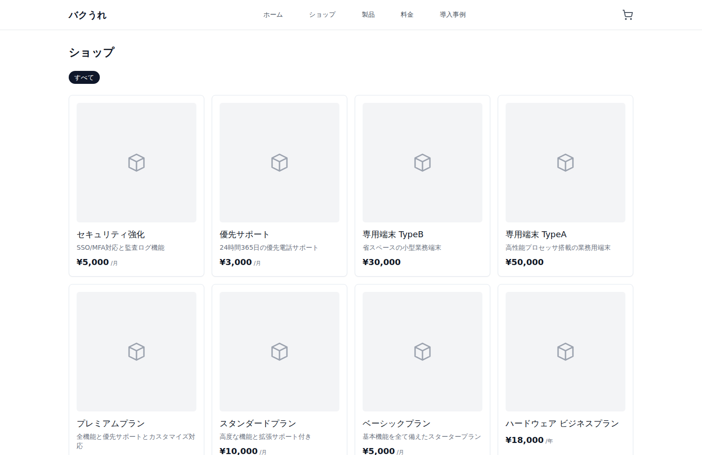 |
| 商品詳細 | 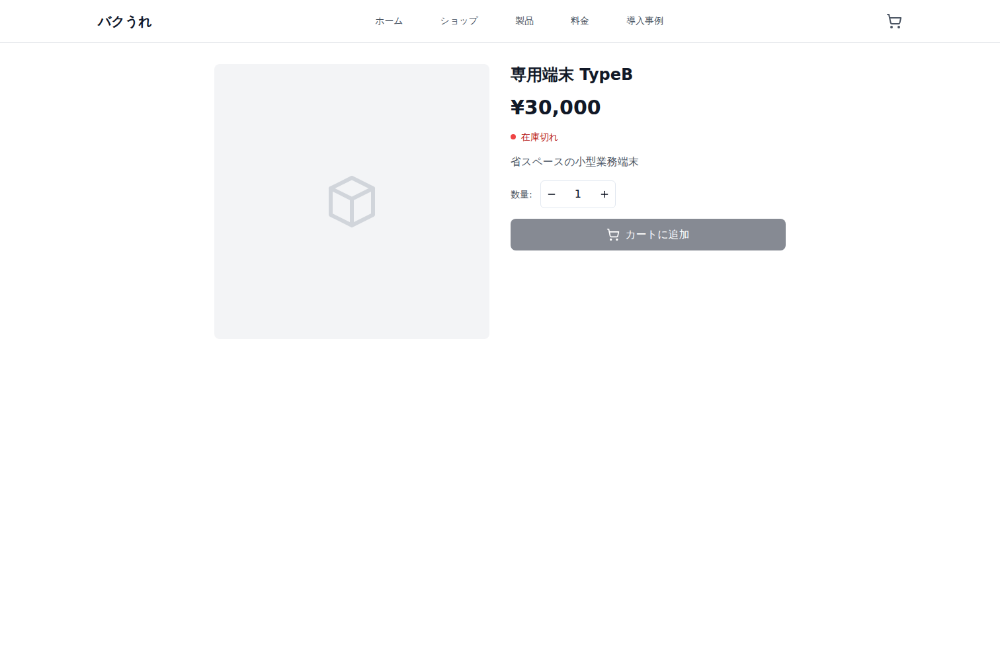 |
| カート（商品あり） | 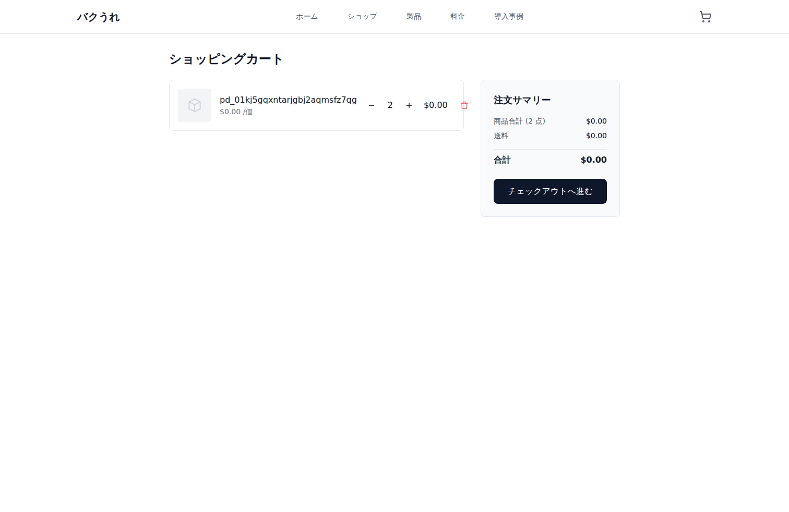 |
| チェックアウト | 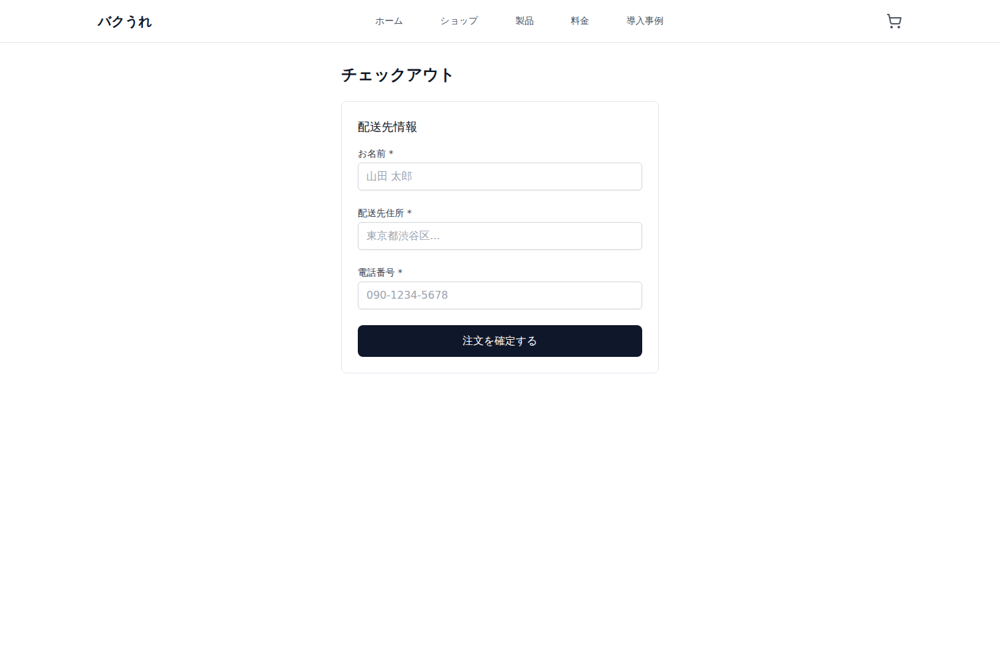 |
| 注文完了 | 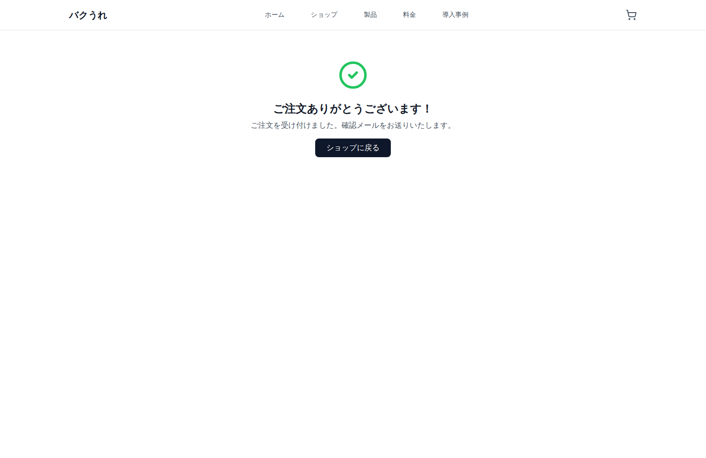 |
| 注文詳細（確認済み） | 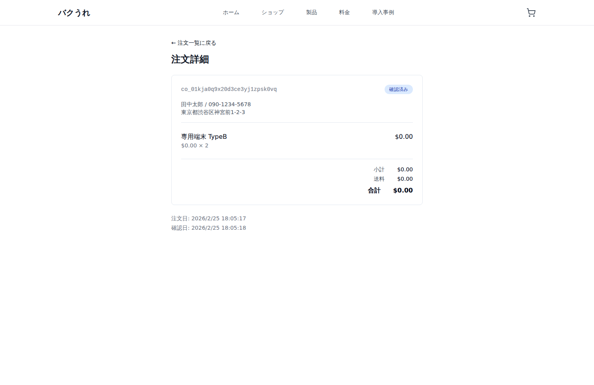 |
| 注文詳細（発送済み） | 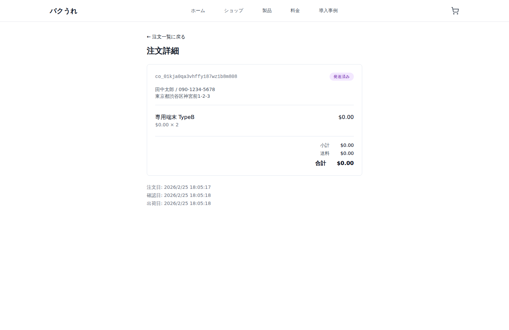 |
| 注文詳細（配送完了） | 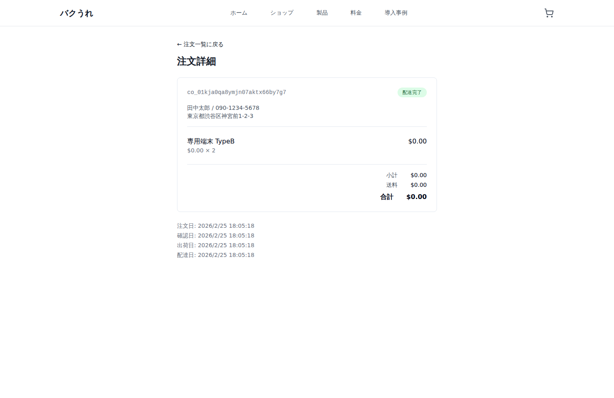 |

### スクリーンショット（管理画面 admin-ui）

| ページ | スクリーンショット |
|--------|------------------|
| 受注管理一覧 | 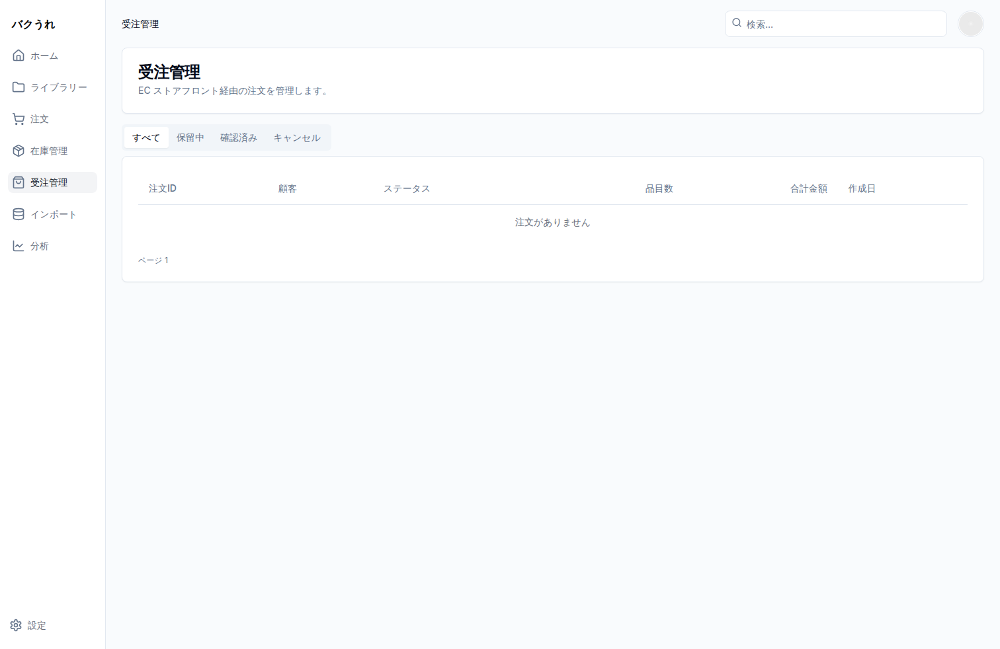 |
| 在庫管理一覧 | 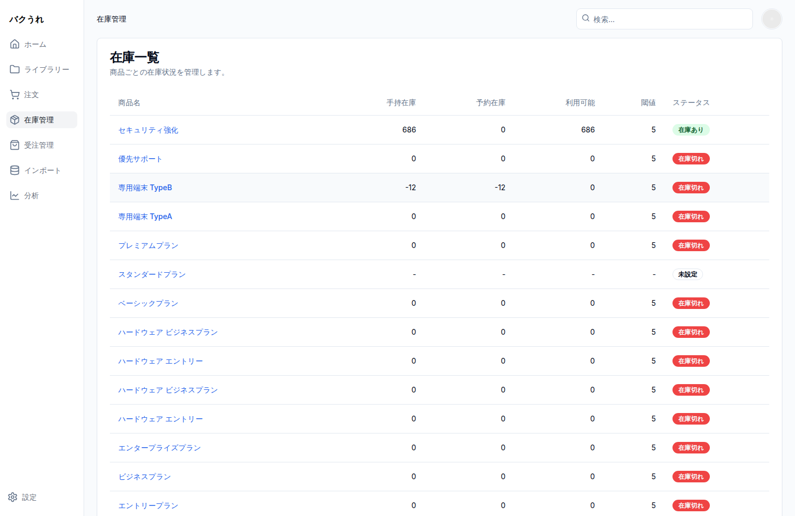 |
| 在庫詳細（変動履歴） | 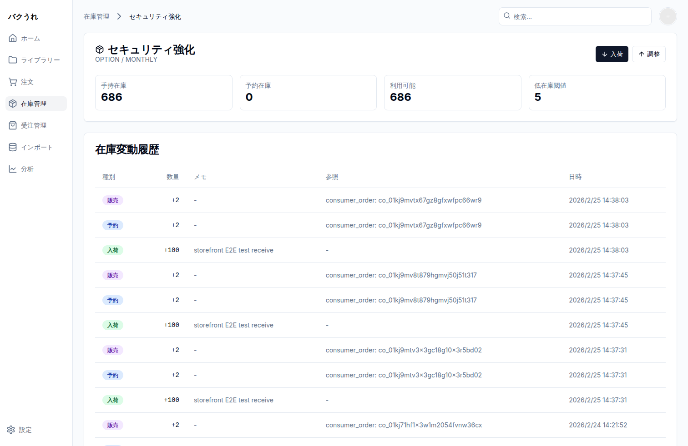 |
| 注文詳細（confirmed/出荷ボタン） | 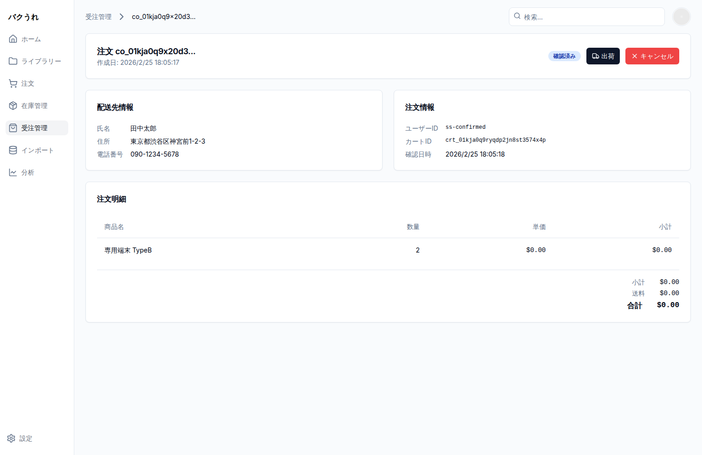 |
| 注文詳細（shipped/配達完了ボタン） | 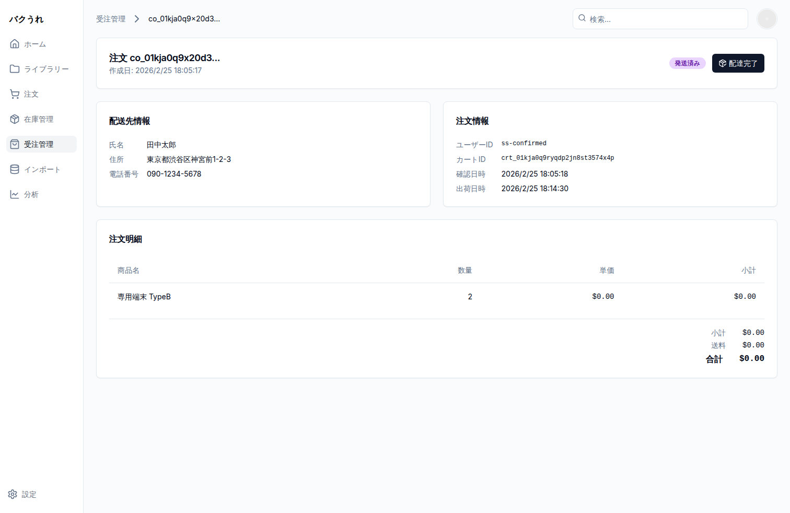 |
| 注文詳細（delivered/最終状態） | 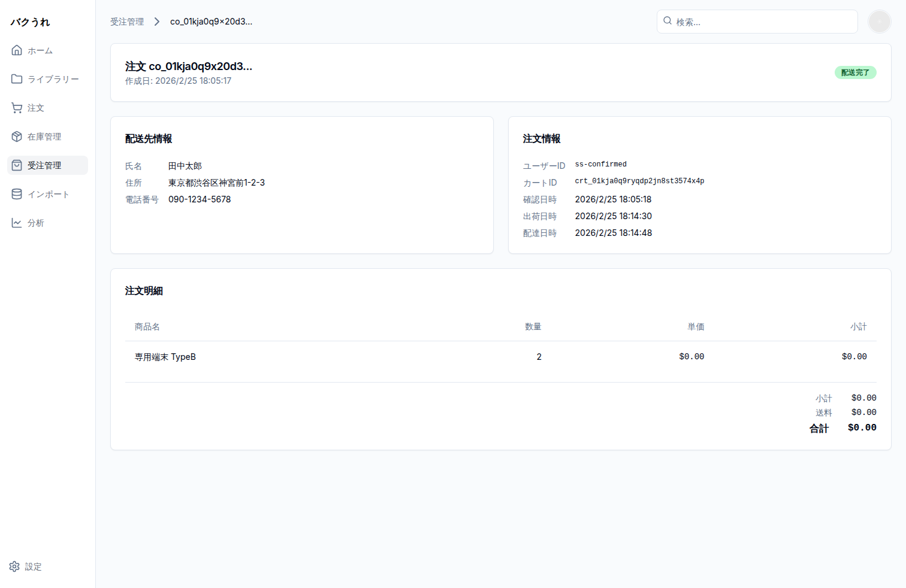 |

## 進捗

- [x] Step 1: Ship / Deliver アプリケーションサービス（PR #1219 で実装済み）
- [x] Step 2: REST ハンドラー（storefront.rs に ship_order/deliver_order 追加）
- [x] Step 3: bakuure-api クライアント（ship_order/deliver_order 追加）
- [x] Step 4: E2E シナリオテスト（39ステップ、ship/deliver含む全フロー検証済み）
- [x] Step 5: コンパイルチェック & テスト実行（全33シナリオ成功）
- [x] Step 6: 管理画面 UI（GraphQL mutation + 出荷/配達ボタン、Playwright動作確認済み）
- [x] Step 7: ショップ UI 改善（ステータス日本語バッジ + 日時表示、Playwright動作確認済み）
