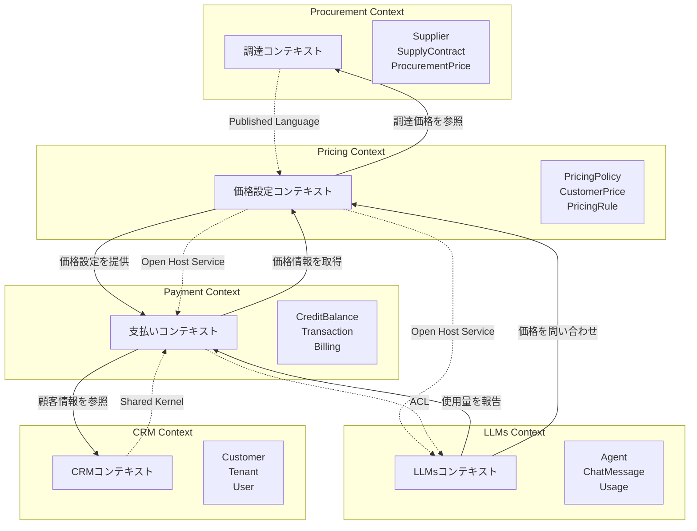

# 調達・価格設定システム ディレクトリ構造

## packages/procurement/ (新規作成)

```
packages/procurement/
├── domain/                                 # 独立したdomainクレート
│   ├── Cargo.toml                         # [package] name = "procurement_domain"
│   └── src/
│       ├── lib.rs                         # pub mod宣言とpub use
│       ├── supplier.rs                    # Supplierエンティティ
│       ├── supply_contract.rs             # SupplyContractエンティティ
│       ├── procurement_price.rs           # ProcurementPrice値オブジェクト
│       ├── volume_discount.rs             # VolumeDiscount値オブジェクト
│       ├── repository.rs                  # リポジトリトレイト定義
│       └── service/                       # ドメインサービス（必要に応じて）
│           ├── mod.rs
│           └── price_calculator.rs
├── src/                                   # アプリケーション層
│   ├── usecase/                           # ユースケース層（フラットな構造）
│   │   ├── boundary/                      # 境界定義・インターフェース
│   │   │   ├── mod.rs
│   │   │   └── input_port.rs             # InputPortトレイト定義
│   │   ├── create_supplier.rs             # サプライヤー作成
│   │   ├── update_supplier.rs             # サプライヤー更新
│   │   ├── list_suppliers.rs              # サプライヤー一覧
│   │   ├── create_contract.rs             # 契約作成
│   │   ├── update_contract.rs             # 契約更新
│   │   ├── terminate_contract.rs          # 契約終了
│   │   ├── register_procurement_price.rs  # 調達価格登録
│   │   ├── update_procurement_price.rs    # 調達価格更新
│   │   ├── get_current_price.rs           # 現在価格取得
│   │   └── mod.rs
│   ├── adapter/                           # インターフェースアダプター層
│   │   ├── axum/                          # HTTP APIハンドラー
│   │   │   ├── procurement_handler.rs
│   │   │   └── mod.rs
│   │   ├── gateway/                       # リポジトリ実装
│   │   │   ├── sqlx_supplier_repository.rs
│   │   │   ├── sqlx_contract_repository.rs
│   │   │   ├── sqlx_price_repository.rs
│   │   │   └── mod.rs
│   │   ├── controller/                    # コントローラー
│   │   │   ├── procurement_controller.rs
│   │   │   └── mod.rs
│   │   ├── graphql/                       # GraphQLリゾルバー
│   │   │   ├── schema.rs
│   │   │   ├── query.rs
│   │   │   ├── mutation.rs
│   │   │   └── mod.rs
│   │   └── mod.rs
│   ├── app.rs                             # アプリケーション構成
│   └── lib.rs
├── migrations/
│   ├── 001_create_suppliers.sql
│   ├── 002_create_supply_contracts.sql
│   ├── 003_create_procurement_prices.sql
│   └── 004_create_indexes.sql
├── Cargo.toml                             # ワークスペースメンバー
└── README.md
```

## packages/payment/src/domain/ (拡張)

```
packages/payment/src/domain/
├── mod.rs                                 # 既存のmod宣言に追加
├── pricing_policy.rs                      # PricingPolicyエンティティ
├── customer_segment.rs                    # CustomerSegmentエンティティ  
├── pricing_rule.rs                        # PricingRule値オブジェクト
├── markup_rate.rs                         # MarkupRate値オブジェクト
├── customer_price.rs                      # CustomerPrice値オブジェクト
├── price_adjustment.rs                    # PriceAdjustment値オブジェクト
├── repository.rs                          # 既存のリポジトリトレイトに追加
│                                          # - PricingPolicyRepository
│                                          # - CustomerPriceRepository
│                                          # - PriceHistoryRepository
└── service/                               # ドメインサービス
    ├── mod.rs
    ├── pricing_service.rs                 # 価格計算サービス
    ├── price_calculator.rs                # 価格計算エンジン
    └── rule_engine.rs                     # ルールエンジン
```

## apps/tachyon-api/ (GraphQL統合)

tachyon-apiでは、procurementパッケージのGraphQLスキーマとリゾルバーを統合します：

```
apps/tachyon-api/
├── src/
│   ├── main.rs                            # ProcurementAppの統合
│   └── lib.rs
└── schema.graphql                         # 統合GraphQLスキーマ
                                          # procurement::adapter::graphql::schemaをマージ
```

GraphQLの実装は`packages/procurement/src/adapter/graphql/`に含まれているため、
tachyon-apiではそれらを統合して使用します。

## apps/tachyon/ (フロントエンドUI)

```
apps/tachyon/src/app/v1beta/[operatorId]/
├── procurement/
│   ├── page.tsx                          # 調達管理ダッシュボード
│   ├── layout.tsx
│   ├── suppliers/
│   │   ├── page.tsx                      # サプライヤー一覧
│   │   ├── [supplierId]/
│   │   │   ├── page.tsx                  # サプライヤー詳細
│   │   │   └── edit/
│   │   │       └── page.tsx              # サプライヤー編集
│   │   └── new/
│   │       └── page.tsx                  # サプライヤー新規作成
│   ├── contracts/
│   │   ├── page.tsx                      # 契約一覧
│   │   ├── [contractId]/
│   │   │   ├── page.tsx                  # 契約詳細
│   │   │   ├── edit/
│   │   │   │   └── page.tsx              # 契約編集
│   │   │   └── prices/
│   │   │       └── page.tsx              # 調達価格管理
│   │   └── new/
│   │       └── page.tsx                  # 契約新規作成
│   └── components/
│       ├── SupplierList.tsx
│       ├── SupplierForm.tsx
│       ├── ContractList.tsx
│       ├── ContractForm.tsx
│       ├── ProcurementPriceTable.tsx
│       ├── CostAnalysisDashboard.tsx
│       └── PriceHistoryChart.tsx
│
├── pricing/
│   ├── page.tsx                          # 価格設定ダッシュボード
│   ├── layout.tsx
│   ├── policies/
│   │   ├── page.tsx                      # ポリシー一覧
│   │   ├── [policyId]/
│   │   │   ├── page.tsx                  # ポリシー詳細
│   │   │   ├── edit/
│   │   │   │   └── page.tsx              # ポリシー編集
│   │   │   └── rules/
│   │   │       └── page.tsx              # ルール管理
│   │   └── new/
│   │       └── page.tsx                  # ポリシー新規作成
│   ├── simulation/
│   │   └── page.tsx                      # 価格シミュレーター
│   ├── segments/
│   │   ├── page.tsx                      # 顧客セグメント管理
│   │   └── [segmentId]/
│   │       └── page.tsx                  # セグメント詳細
│   ├── history/
│   │   └── page.tsx                      # 価格変更履歴
│   └── components/
│       ├── PricingPolicyList.tsx
│       ├── PricingPolicyForm.tsx
│       ├── PricingRuleEditor.tsx
│       ├── PriceSimulator.tsx
│       ├── CustomerPriceTable.tsx
│       ├── MarkupCalculator.tsx
│       ├── PriceChangeHistory.tsx
│       └── ProfitMarginChart.tsx
```

## 共通コンポーネント (packages/ui/)

```
packages/ui/src/components/procurement/
├── PriceDisplay.tsx                      # 価格表示（通貨対応）
├── CurrencySelector.tsx                  # 通貨選択
├── DateRangePicker.tsx                   # 期間選択
├── VolumeDiscountEditor.tsx              # ボリュームディスカウント設定
├── PriceComparisonTable.tsx              # 価格比較表
└── index.ts

packages/ui/src/components/pricing/
├── RuleConditionEditor.tsx               # ルール条件エディタ
├── MarkupRateInput.tsx                   # マークアップ率入力
├── PricePreviewCard.tsx                  # 価格プレビュー
├── SegmentSelector.tsx                   # セグメント選択
└── index.ts
```

## GraphQL関連ファイル

```
apps/tachyon/src/graphql/procurement/
├── queries/
│   ├── getSuppliers.graphql
│   ├── getSupplier.graphql
│   ├── getContracts.graphql
│   ├── getCurrentProcurementPrice.graphql
│   └── getProcurementPriceHistory.graphql
├── mutations/
│   ├── createSupplier.graphql
│   ├── updateSupplier.graphql
│   ├── createContract.graphql
│   ├── updateProcurementPrice.graphql
│   └── terminateContract.graphql
└── fragments/
    ├── SupplierFragment.graphql
    ├── ContractFragment.graphql
    └── ProcurementPriceFragment.graphql

apps/tachyon/src/graphql/pricing/
├── queries/
│   ├── getPricingPolicies.graphql
│   ├── getActivePricingPolicy.graphql
│   ├── getCurrentCustomerPrice.graphql
│   ├── getCustomerPriceHistory.graphql
│   └── simulatePrice.graphql
├── mutations/
│   ├── createPricingPolicy.graphql
│   ├── updatePricingPolicy.graphql
│   ├── activatePricingPolicy.graphql
│   ├── recalculateCustomerPrices.graphql
│   └── overrideCustomerPrice.graphql
└── fragments/
    ├── PricingPolicyFragment.graphql
    ├── PricingRuleFragment.graphql
    └── CustomerPriceFragment.graphql
```

## テスト関連

```
packages/procurement/tests/
├── domain/
│   ├── supplier_test.rs
│   ├── contract_test.rs
│   └── procurement_price_test.rs
├── usecase/
│   ├── supplier_usecase_test.rs
│   ├── contract_usecase_test.rs
│   └── price_usecase_test.rs
└── integration/
    └── procurement_integration_test.rs

apps/tachyon/src/app/v1beta/[operatorId]/procurement/__tests__/
├── SupplierList.test.tsx
├── ContractForm.test.tsx
└── PriceSimulator.test.tsx

apps/tachyon/src/app/v1beta/[operatorId]/pricing/__tests__/
├── PricingPolicyList.test.tsx
├── RuleEditor.test.tsx
└── PriceHistory.test.tsx
```

## Storybook

```
apps/workshop/src/stories/procurement/
├── SupplierList.stories.tsx
├── ContractForm.stories.tsx
├── ProcurementPriceTable.stories.tsx
└── CostAnalysisDashboard.stories.tsx

apps/workshop/src/stories/pricing/
├── PricingPolicyForm.stories.tsx
├── RuleConditionEditor.stories.tsx
├── PriceSimulator.stories.tsx
└── ProfitMarginChart.stories.tsx
```

## コンテキストマップ



### コンテキスト間の統合パターン

#### 1. Procurement → Pricing（Published Language）
```rust
// Procurement Context が価格変更イベントを発行
pub struct ProcurementPriceUpdated {
    pub supplier_id: SupplierId,
    pub resource_type: String,
    pub new_price: Decimal,
    pub effective_from: DateTime<Utc>,
}

// Pricing Context が購読して顧客価格を再計算
```

#### 2. Pricing → Payment/LLMs（Open Host Service）
```rust
// Pricing Context が価格サービスを提供
#[async_trait]
pub trait PricingService: Send + Sync {
    async fn get_current_price(
        &self,
        tenant_id: &TenantId,
        resource_type: &str,
    ) -> Result<CustomerPrice>;
}

// Payment/LLMs Context が利用
```

#### 3. Payment ↔ LLMs（Anti-Corruption Layer）
```rust
// Payment Context のインターフェース
#[async_trait]
pub trait PaymentApp: Send + Sync {
    async fn check_billing<'a>(
        &self,
        input: &CheckBillingInput<'a>,
    ) -> Result<()>;
    
    async fn consume_credits<'a>(
        &self,
        input: &ConsumeCreditsInput<'a>,
    ) -> Result<ConsumeCreditsOutput>;
}

// LLMs Context での利用（Payment の詳細を隠蔽）
```

#### 4. CRM → Payment（Shared Kernel）
```rust
// 共有される値オブジェクト
pub struct TenantId(String);
pub struct UserId(String);
pub struct MultiTenancy {
    pub platform: Option<TenantId>,
    pub operator: TenantId,
}
```

### データフローの例

1. **調達価格更新フロー**
   ```
   Supplier API → Procurement Context → PriceUpdatedEvent 
   → Pricing Context → Recalculate Customer Prices
   → Payment Context (価格情報更新通知)
   ```

2. **Agent実行時の課金フロー**
   ```
   User Request → LLMs Context → PricingService.get_current_price()
   → PaymentApp.check_billing() → Agent実行
   → PaymentApp.consume_credits() → Transaction記録
   ```

3. **価格シミュレーション**
   ```
   Admin UI → Pricing Context → Procurement Context (原価取得)
   → 価格計算エンジン → シミュレーション結果
   ```