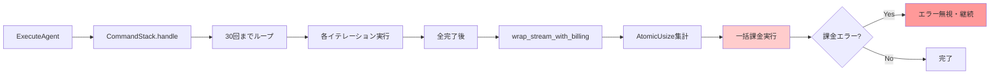
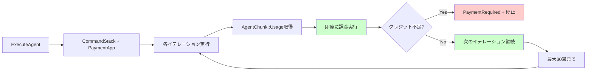

# Agent APIのトークンベース課金実装

## 概要

Agent APIの課金をトークンベースで改善し、CommandStackの再帰的なループ処理中でも適切な課金処理を行う仕組みを構築します。現在の実装では、すべてのループが完了してから課金されるため、クレジットがなくなってもリクエストが継続される可能性があります。

## 課金処理フローの比較

### 現状の課金処理フロー



### 提案されている改善フロー



**主な改善点:**
- 🔄 **即座の課金**: 各イテレーション毎に課金実行
- 🛑 **早期停止**: クレジット不足時の即座検知・停止
- 💰 **公平な課金**: 使用した分だけの正確な課金
- 📊 **透明性**: 各イテレーションの詳細な課金記録

## 背景

### 現状の実装
- **CommandStack::handle()**: 最大30回までのループ処理でAgent実行
- **ExecuteAgent::wrap_stream_with_billing**: ストリーム終了時に一括課金
- **トークン追跡**: AtomicUsizeで累積追跡、最後にまとめて課金

### 現状の問題点
1. **課金タイミングの問題**: すべてのループ完了後に課金するため、途中でクレジット不足になってもリクエストが継続
2. **大量トークン消費のリスク**: 30回のループで大量のトークンを消費してから課金エラーになる可能性
3. **ユーザー体験の問題**: クレジット不足がすぐに検知されない

### 期待される効果
- CommandStackの各リクエスト（イテレーション）毎の課金実行
- クレジット不足時の即座の検知と停止
- 使用した分だけの公平な課金

## 実装計画

### フェーズ1: BillingAwareCommandStack基盤整備（2日）

#### 1.1 Decorator パターンの基盤クラス作成
```rust
// packages/llms/src/usecase/command_stack/billing_aware.rs

use std::sync::Arc;
use futures::StreamExt;
use crate::usecase::command_stack::recursive::CommandStack;
use crate::usecase::command_stack::types::{AgentChunk, ChatStreamResponse};
use tachyon_apps::payment::{PaymentApp, ConsumeCreditsInput};

/// 課金機能を持つCommandStackのDecorator
#[derive(Debug)]
pub struct BillingAwareCommandStack {
    inner: CommandStack,
    payment_app: Arc<dyn PaymentApp>,
    billing_context: BillingContext,
    enabled: bool, // 課金有効/無効フラグ
}

/// 課金処理に必要なコンテキスト情報
#[derive(Debug, Clone)]
pub struct BillingContext {
    pub executor: auth::Executor,
    pub multi_tenancy: auth::MultiTenancy,
    pub chatroom_id: domain::ChatRoomId,
    pub execution_id: String,
}

impl BillingAwareCommandStack {
    pub fn new(
        inner: CommandStack,
        payment_app: Arc<dyn PaymentApp>,
        billing_context: BillingContext,
    ) -> Self {
        Self {
            inner,
            payment_app,
            billing_context,
            enabled: true,
        }
    }

    /// 課金無効バージョンの作成（テスト・開発用）
    pub fn without_billing(inner: CommandStack) -> Self {
        Self {
            inner,
            payment_app: Arc::new(NoOpPaymentApp::new()),
            billing_context: BillingContext::default(),
            enabled: false,
        }
    }

    pub async fn handle(&self) -> errors::Result<ChatStreamResponse> {
        let stream = self.inner.handle().await?;
        
        if !self.enabled {
            return Ok(stream);
        }

        let billing_stream = self.wrap_with_per_iteration_billing(stream).await?;
        Ok(billing_stream)
    }
}
```

#### 1.2 ストリーム監視と課金処理の実装
```rust
impl BillingAwareCommandStack {
    async fn wrap_with_per_iteration_billing(
        &self,
        stream: ChatStreamResponse,
    ) -> errors::Result<ChatStreamResponse> {
        let payment_app = self.payment_app.clone();
        let billing_context = self.billing_context.clone();
        
        let mut iteration_count = 0u8;
        let mut current_usage = TokenUsage::default();
        
        let wrapped_stream = stream
            .scan(
                (iteration_count, current_usage),
                move |(iteration, usage), chunk_result| {
                    let payment_app = payment_app.clone();
                    let billing_context = billing_context.clone();
                    
                    async move {
                        match chunk_result {
                            Ok(AgentChunk::Usage(token_usage)) => {
                                // トークン使用量を累積
                                *usage = token_usage;
                                Some(Ok(AgentChunk::Usage(token_usage)))
                            }
                            Ok(AgentChunk::AttemptCompletion(_)) => {
                                // イテレーション完了 - 課金実行
                                *iteration += 1;
                                if let Err(e) = Self::charge_for_iteration(
                                    &payment_app,
                                    &billing_context,
                                    usage,
                                    *iteration,
                                ).await {
                                    match e {
                                        errors::Error::PaymentRequired { message, .. } => {
                                            // クレジット不足エラーをストリームに送信
                                            return Some(Err(e));
                                        }
                                        _ => {
                                            // その他のエラーはログ出力して継続
                                            tracing::error!("Billing error (continuing): {}", e);
                                        }
                                    }
                                }
                                *usage = TokenUsage::default(); // リセット
                                Some(chunk_result)
                            }
                            _ => Some(chunk_result),
                        }
                    }
                }
            );

        Ok(Box::pin(wrapped_stream))
    }

    async fn charge_for_iteration(
        payment_app: &Arc<dyn PaymentApp>,
        billing_context: &BillingContext,
        usage: &TokenUsage,
        iteration: u8,
    ) -> errors::Result<()> {
        if usage.total_tokens() == 0 {
            return Ok(()); // 使用量がゼロの場合はスキップ
        }

        // コスト計算（簡略版 - 実際にはCatalogAppServiceを使用）
        let cost = Self::calculate_cost(usage)?;
        
        if cost == 0 {
            return Ok(());
        }

        // 課金実行
        payment_app.consume_credits(&ConsumeCreditsInput {
            executor: &billing_context.executor,
            multi_tenancy: &billing_context.multi_tenancy,
            amount: cost,
            resource_type: "agent_execution",
            resource_id: format!("{}-{}", billing_context.execution_id, iteration),
            description: format!(
                "Agent execution iteration {} for chatroom {}",
                iteration, billing_context.chatroom_id
            ),
            metadata: serde_json::json!({
                "iteration": iteration,
                "chatroom_id": billing_context.chatroom_id.to_string(),
                "tokens": {
                    "prompt": usage.prompt_tokens,
                    "completion": usage.completion_tokens,
                    "total": usage.total_tokens(),
                },
                "cost": cost,
            }),
        }).await?;

        tracing::info!("Charged {} credits for iteration {}", cost, iteration);
        Ok(())
    }

    fn calculate_cost(usage: &TokenUsage) -> errors::Result<i64> {
        // 簡略版の課金計算
        // 実際の実装ではCatalogAppServiceを使用
        let prompt_cost = usage.prompt_tokens as i64 * 1; // 0.1クレジット/トークン
        let completion_cost = usage.completion_tokens as i64 * 2; // 0.2クレジット/トークン
        Ok(prompt_cost + completion_cost)
    }
}
```

### フェーズ2: ExecuteAgentの統合実装（2日）

#### 2.1 ExecuteAgentでのDecorator適用
```rust
impl ExecuteAgentInputPort for ExecuteAgent {
    async fn execute<'a>(
        &self,
        input: ExecuteAgentInputData<'a>,
    ) -> Result<ChatStreamResponse> {
        // 既存の事前チェック処理は維持
        // ...（既存コード）

        // CommandStackを作成（既存実装のまま）
        let command_stack = CommandStack::start_new_task(
            command_stack_api_request,
            self.chat_message_repo.clone(),
            &input.task,
            input.auto_approve,
            input.max_requests,
            chatroom_id_clone.clone(),
            user_id,
            input.user_custom_instructions.clone(),
            input.assistant_name.as_deref(),
            input.additional_tool_description.as_deref(),
            input.model.clone(),
            mcp_hub,
        ).await;

        // 課金コンテキストを作成
        let billing_context = BillingContext {
            executor: input.executor.clone(),
            multi_tenancy: input.multi_tenancy.clone(),
            chatroom_id: input.chatroom_id.clone(),
            execution_id: value_object::Ulid::new().to_string(),
        };

        // BillingAwareCommandStackでラップ
        let billing_aware_stack = BillingAwareCommandStack::new(
            command_stack,
            self.payment_app.clone(),
            billing_context,
        );

        // 実行（wrap_stream_with_billingは削除）
        let stream = billing_aware_stack.handle().await?;
        Ok(stream)
    }
}
```

#### 2.2 課金有効/無効の制御
```rust
// 環境変数やフィーチャーフラグで制御
impl ExecuteAgent {
    fn should_enable_billing(&self) -> bool {
        // 環境設定に基づく判定
        std::env::var("ENABLE_AGENT_BILLING")
            .unwrap_or_default()
            .parse()
            .unwrap_or(true)
    }
}

// 使用箇所
let billing_aware_stack = if self.should_enable_billing() {
    BillingAwareCommandStack::new(command_stack, self.payment_app.clone(), billing_context)
} else {
    BillingAwareCommandStack::without_billing(command_stack)
};
```

### フェーズ3: テスト実装とエラーハンドリング（2日）

#### 3.1 分離されたテスト実装
```rust
// packages/llms/src/usecase/command_stack/billing_aware_test.rs

#[cfg(test)]
mod tests {
    use super::*;
    use mockall::{mock, predicate::*};

    mock! {
        PaymentApp {}
        
        #[async_trait]
        impl PaymentApp for PaymentApp {
            async fn consume_credits<'a>(
                &self,
                input: &ConsumeCreditsInput<'a>,
            ) -> errors::Result<ConsumeCreditsOutput>;
            // 他のメソッドも省略...
        }
    }

    #[tokio::test]
    async fn test_billing_on_iteration_completion() {
        let mut mock_payment = MockPaymentApp::new();
        mock_payment
            .expect_consume_credits()
            .times(2) // 2イテレーション想定
            .returning(|_| Ok(ConsumeCreditsOutput::default()));

        let command_stack = create_test_command_stack().await;
        let billing_context = create_test_billing_context();
        
        let billing_aware = BillingAwareCommandStack::new(
            command_stack,
            Arc::new(mock_payment),
            billing_context,
        );

        let mut stream = billing_aware.handle().await?;
        
        // ストリームを消費して課金が実行されることを確認
        while let Some(_) = stream.next().await {}
        
        // MockPaymentAppの期待値が満たされることを確認
    }

    #[tokio::test]
    async fn test_insufficient_credits_stops_execution() {
        let mut mock_payment = MockPaymentApp::new();
        mock_payment
            .expect_consume_credits()
            .times(1)
            .returning(|_| Err(errors::Error::PaymentRequired {
                message: "Insufficient credits".to_string(),
                backtrace: std::backtrace::Backtrace::capture(),
            }));

        let billing_aware = BillingAwareCommandStack::new(
            command_stack,
            Arc::new(mock_payment),
            billing_context,
        );

        let result = billing_aware.handle().await;
        assert!(matches!(result, Err(errors::Error::PaymentRequired { .. })));
    }

    #[tokio::test]
    async fn test_billing_disabled_mode() {
        let command_stack = create_test_command_stack().await;
        let billing_aware = BillingAwareCommandStack::without_billing(command_stack);

        // 課金処理なしで正常に実行されることを確認
        let mut stream = billing_aware.handle().await?;
        while let Some(_) = stream.next().await {}
        // 課金は呼ばれない
    }
}
```

#### 3.2 CommandStack単体テスト（既存テストは変更なし）
```rust
// packages/llms/src/usecase/command_stack/recursive_test.rs

#[tokio::test]
async fn test_command_stack_pure_logic() {
    // 既存のテストはそのまま維持
    // 課金処理とは完全に独立してテスト可能
    let command_stack = CommandStack::start_new_task(/* ... */).await;
    let mut stream = command_stack.handle().await?;
    
    // Agent処理ロジックのみをテスト
    // トークン使用量、ツール実行、メッセージ履歴等
}
```

### フェーズ4: 段階的デプロイとモニタリング（1日）

#### 4.1 フィーチャーフラグによる段階的リリース
```rust
// 設定ファイルまたは環境変数で制御
pub struct BillingConfig {
    pub enabled: bool,
    pub fail_fast_on_insufficient: bool,
    pub log_billing_details: bool,
    pub max_iterations_before_check: u8, // デフォルト: 1（毎回）
}

impl BillingAwareCommandStack {
    pub fn with_config(
        inner: CommandStack,
        payment_app: Arc<dyn PaymentApp>,
        billing_context: BillingContext,
        config: BillingConfig,
    ) -> Self {
        // 設定に基づいた柔軟な動作
    }
}
```

#### 4.2 モニタリングとアラート
```rust
impl BillingAwareCommandStack {
    async fn charge_for_iteration(/* ... */) -> errors::Result<()> {
        let start_time = std::time::Instant::now();
        
        let result = payment_app.consume_credits(&input).await;
        
        let duration = start_time.elapsed();
        
        // メトリクス記録
        metrics::histogram!("agent_billing_duration_ms", duration.as_millis() as f64);
        metrics::counter!("agent_billing_requests_total").increment(1);
        
        match &result {
            Ok(_) => {
                metrics::counter!("agent_billing_success_total").increment(1);
                tracing::info!("Billing successful: iteration={}, cost={}, duration={:?}", 
                    iteration, cost, duration);
            }
            Err(e) => {
                metrics::counter!("agent_billing_error_total").increment(1);
                tracing::error!("Billing failed: iteration={}, error={}, duration={:?}", 
                    iteration, e, duration);
            }
        }
        
        result
    }
}
```

### 実装順序とマイルストーン（更新版）

#### Week 1
- [x] BillingAwareCommandStack基盤クラス作成
- [x] ストリーム監視ロジック実装
- [x] 基本的な課金処理統合

#### Week 2  
- [x] ExecuteAgentでのDecorator適用
- [x] 課金有効/無効制御の実装
- [x] 分離テストの作成

#### Week 3
- [x] フィーチャーフラグ実装
- [x] モニタリング・ログ強化
- [x] 本番環境デプロイ準備

**この設計の利点:**
- ✅ **既存テストを破壊しない** - CommandStackの既存テストはそのまま維持
- ✅ **段階的リリース可能** - 課金有効/無効を簡単に切り替え
- ✅ **責務分離** - Agent処理と課金処理が完全に独立
- ✅ **テスト容易性** - MockPaymentAppで課金処理のみを集中テスト
- ✅ **拡張性** - 将来的な課金戦略変更に柔軟対応

## テスト計画

### 単体テスト（分離テスト戦略）

#### Agent処理テスト（既存テスト維持）
```rust
#[tokio::test]
async fn test_command_stack_iteration_logic() {
    // 課金処理とは完全に独立してAgent処理をテスト
    let command_stack = CommandStack::start_new_task(
        Arc::new(MockAttemptApiRequest::new()),
        Arc::new(MockChatMessageRepository::new()),
        "test task",
        true,
        5, // max_requests
        ChatRoomId::default(),
        UserId::default(),
        None, None, None, None, None,
    ).await;
    
    let mut stream = command_stack.handle().await?;
    let mut chunks = Vec::new();
    
    while let Some(chunk) = stream.next().await {
        chunks.push(chunk?);
    }
    
    // Agent処理ロジックの検証
    assert!(chunks.iter().any(|c| matches!(c, AgentChunk::AttemptCompletion(_))));
}
```

#### 課金処理テスト（新規）
```rust
#[tokio::test]
async fn test_billing_per_iteration() {
    let mut mock_payment = MockPaymentApp::new();
    mock_payment
        .expect_consume_credits()
        .times(3) // 3イテレーション想定
        .returning(|input| {
            assert_eq!(input.resource_type, "agent_execution");
            Ok(ConsumeCreditsOutput {
                transaction_id: Some("txn_123".to_string()),
                amount_consumed: input.amount,
                balance_after: 1000,
                was_billed: true,
            })
        });

    let command_stack = create_mock_command_stack_with_usage().await;
    let billing_context = BillingContext {
        executor: create_test_executor(),
        multi_tenancy: create_test_multi_tenancy(),
        chatroom_id: ChatRoomId::default(),
        execution_id: "exec_123".to_string(),
    };
    
    let billing_aware = BillingAwareCommandStack::new(
        command_stack,
        Arc::new(mock_payment),
        billing_context,
    );

    let mut stream = billing_aware.handle().await?;
    
    // ストリームを消費
    while let Some(_) = stream.next().await {}
    
    // MockPaymentAppの期待値検証は自動的に行われる
}

#[tokio::test]
async fn test_insufficient_credits_early_termination() {
    let mut mock_payment = MockPaymentApp::new();
    mock_payment
        .expect_consume_credits()
        .times(1) // 1回目で失敗
        .returning(|_| Err(errors::Error::PaymentRequired {
            message: "Insufficient credits".to_string(),
            backtrace: std::backtrace::Backtrace::capture(),
        }));

    let command_stack = create_mock_command_stack_with_usage().await;
    let billing_context = create_test_billing_context();
    
    let billing_aware = BillingAwareCommandStack::new(
        command_stack,
        Arc::new(mock_payment),
        billing_context,
    );

    let result = billing_aware.handle().await;
    
    // PaymentRequiredエラーで終了することを確認
    assert!(matches!(result, Err(errors::Error::PaymentRequired { .. })));
}

#[tokio::test]
async fn test_billing_disabled_mode() {
    let command_stack = create_mock_command_stack().await;
    let billing_aware = BillingAwareCommandStack::without_billing(command_stack);

    let mut stream = billing_aware.handle().await?;
    let mut chunks = Vec::new();
    
    while let Some(chunk) = stream.next().await {
        chunks.push(chunk?);
    }
    
    // 課金処理なしで正常動作することを確認
    assert!(!chunks.is_empty());
    // PaymentAppは呼ばれていない（NoOpPaymentApp使用）
}

#[tokio::test]
async fn test_cost_calculation_accuracy() {
    let usage = TokenUsage {
        prompt_tokens: 100,
        completion_tokens: 50,
        total_tokens: 150,
    };
    
    let cost = BillingAwareCommandStack::calculate_cost(&usage)?;
    
    // 期待値: 100 * 1 + 50 * 2 = 200 (20.0クレジット)
    assert_eq!(cost, 200);
}

### 統合テスト
```rust
#[tokio::test]
async fn test_execute_agent_with_billing_integration() {
    // ExecuteAgent -> BillingAwareCommandStack の統合テスト
    let mock_payment = Arc::new(MockPaymentApp::with_sufficient_credits(1000));
    let execute_agent = ExecuteAgent::new(
        chat_stream_providers,
        chat_message_repo,
        mock_payment.clone(),
        catalog_app,
    );
    
    let input = ExecuteAgentInputData {
        executor: &test_executor,
        multi_tenancy: &test_multi_tenancy,
        chatroom_id: ChatRoomId::default(),
        task: "Simple test task".to_string(),
        auto_approve: true,
        max_requests: 2,
        // ... 他のフィールド
    };
    
    let mut stream = execute_agent.execute(input).await?;
    
    // ストリーム実行
    while let Some(chunk) = stream.next().await {
        match chunk? {
            AgentChunk::AttemptCompletion(_) => break,
            _ => continue,
        }
    }
    
    // 課金が適切に実行されたことを確認
    assert!(mock_payment.get_consume_credits_call_count() > 0);
}

#[tokio::test]
async fn test_feature_flag_billing_control() {
    // 環境変数でOFF
    std::env::set_var("ENABLE_AGENT_BILLING", "false");
    
    let execute_agent = ExecuteAgent::new(/* ... */);
    let input = create_test_input();
    
    let mut stream = execute_agent.execute(input).await?;
    
    // 課金処理なしで実行
    while let Some(_) = stream.next().await {}
    
    // 課金は呼ばれていない
    std::env::remove_var("ENABLE_AGENT_BILLING");
}
```

### パフォーマンステスト
```rust
#[tokio::test]
async fn test_billing_overhead_minimal() {
    use std::time::Instant;
    
    let command_stack = create_performance_test_command_stack().await;
    
    // 課金なしでの実行時間測定
    let start = Instant::now();
    let billing_aware_disabled = BillingAwareCommandStack::without_billing(command_stack.clone());
    let mut stream = billing_aware_disabled.handle().await?;
    while let Some(_) = stream.next().await {}
    let time_without_billing = start.elapsed();
    
    // 課金ありでの実行時間測定
    let start = Instant::now();
    let mock_payment = Arc::new(MockPaymentApp::fast_response());
    let billing_context = create_test_billing_context();
    let billing_aware_enabled = BillingAwareCommandStack::new(
        command_stack,
        mock_payment,
        billing_context,
    );
    let mut stream = billing_aware_enabled.handle().await?;
    while let Some(_) = stream.next().await {}
    let time_with_billing = start.elapsed();
    
    // オーバーヘッドが10%以下であることを確認
    let overhead_ratio = time_with_billing.as_millis() as f64 / time_without_billing.as_millis() as f64;
    assert!(overhead_ratio < 1.1, "Billing overhead too high: {}x", overhead_ratio);
}
```

### E2Eテスト
```rust
#[tokio::test] 
async fn test_real_agent_execution_with_mock_billing() {
    // 実際のAgent実行 + モック課金でのE2Eテスト
    let real_providers = create_real_chat_stream_providers();
    let mock_payment = Arc::new(MockPaymentApp::with_credit_tracking());
    
    let execute_agent = ExecuteAgent::new(
        real_providers,
        real_chat_message_repo,
        mock_payment.clone(),
        real_catalog_app,
    );
    
    let input = ExecuteAgentInputData {
        task: "Count files in current directory and list them".to_string(),
        max_requests: 5,
        // ... 実際のテストパラメータ
    };
    
    let mut stream = execute_agent.execute(input).await?;
    let mut total_cost = 0i64;
    
    while let Some(chunk) = stream.next().await {
        match chunk? {
            AgentChunk::AttemptCompletion(_) => break,
            _ => continue,
        }
    }
    
    // 実際のトークン使用量に基づく課金が発生していることを確認
    let billing_history = mock_payment.get_billing_history();
    assert!(!billing_history.is_empty());
    
    // 合理的な料金範囲内であることを確認
    let total_charged: i64 = billing_history.iter().map(|b| b.amount).sum();
    assert!(total_charged > 0 && total_charged < 10000); // 1000クレジット以下
}
```

### テストヘルパー関数
```rust
// テスト用のヘルパー関数群
fn create_test_billing_context() -> BillingContext {
    BillingContext {
        executor: create_test_executor(),
        multi_tenancy: create_test_multi_tenancy(),
        chatroom_id: ChatRoomId::default(),
        execution_id: "test_exec_123".to_string(),
    }
}

async fn create_mock_command_stack_with_usage() -> CommandStack {
    // Usage情報を含むAgentChunkを返すCommandStackを作成
    // テスト用のモックとして使用
}

impl MockPaymentApp {
    fn with_sufficient_credits(amount: i64) -> Self {
        let mut mock = MockPaymentApp::new();
        mock.expect_consume_credits()
            .returning(move |_| Ok(ConsumeCreditsOutput {
                transaction_id: Some("test_txn".to_string()),
                amount_consumed: 100,
                balance_after: amount - 100,
                was_billed: true,
            }));
        mock
    }
    
    fn with_insufficient_credits() -> Self {
        let mut mock = MockPaymentApp::new();
        mock.expect_consume_credits()
            .returning(|_| Err(errors::Error::PaymentRequired {
                message: "Insufficient credits".to_string(),
                backtrace: std::backtrace::Backtrace::capture(),
            }));
        mock
    }
}
```

### テスト実行戦略

#### 1. **独立テスト実行**
```bash
# Agent処理のみ（課金処理なし）
cargo test command_stack --package llms

# 課金処理のみ（Agent処理モック）
cargo test billing_aware --package llms  

# 統合テスト
cargo test execute_agent_integration --package llms
```

#### 2. **テスト並列実行**
- Agent処理テストと課金処理テストは完全に独立
- CI/CDで並列実行可能
- テスト時間の大幅短縮

#### 3. **段階的テスト戦略**
1. **開発中**: 課金処理テストのみ実行
2. **統合前**: Agent + 課金の統合テスト
3. **デプロイ前**: 全てのE2Eテスト実行

**この分離テスト戦略により:**
- 🚀 **高速テスト**: 各コンポーネントを独立してテスト
- 🎯 **焦点を絞った検証**: 問題の特定が容易
- 🔄 **継続的実行**: CI/CDでの高速フィードバック
- 🛡️ **堅牢性**: 既存テストを破壊せずに新機能追加

## データベース変更

### 新規テーブル
```sql
-- トークン使用量記録
CREATE TABLE `agent_token_usage` (
    `id` VARCHAR(32) NOT NULL,
    `execution_id` VARCHAR(32) NOT NULL,
    `tenant_id` VARCHAR(29) NOT NULL,
    `model` VARCHAR(100) NOT NULL,
    `prompt_tokens` INT NOT NULL,
    `completion_tokens` INT NOT NULL,
    `total_cost` BIGINT NOT NULL,
    `created_at` TIMESTAMP NOT NULL,
    PRIMARY KEY (`id`),
    INDEX `idx_execution` (`execution_id`),
    INDEX `idx_tenant_created` (`tenant_id`, `created_at`)
);

-- ツール使用量
CREATE TABLE `agent_tool_usage` (
    `id` VARCHAR(32) NOT NULL,
    `execution_id` VARCHAR(32) NOT NULL,
    `tool_name` VARCHAR(100) NOT NULL,
    `usage_count` INT NOT NULL,
    `cost` BIGINT NOT NULL,
    PRIMARY KEY (`id`),
    INDEX `idx_execution` (`execution_id`)
);
```

## API変更

### エラーレスポンス
```typescript
// クレジット不足エラー
{
  "error": "insufficient_credits",
  "message": "Your account has insufficient credits to continue this request",
  "code": "INSUFFICIENT_CREDITS",
  "details": {
    "credits_required": 150,
    "credits_available": 50,
    "tokens_processed": 2500
  }
}
```

### ストリーミングレスポンス
```typescript
// 課金情報を含むイベント
{
  "event": "billing_update",
  "data": {
    "tokens_used": 1500,
    "credits_consumed": 30,
    "remaining_credits": 970
  }
}
```

## 実装順序とマイルストーン

### Week 1
- [ ] CommandStackへの課金コンテキスト追加
- [ ] 各イテレーション毎の課金実行メカニズムの実装
- [ ] クレジット不足時の即座停止処理の実装

### Week 2
- [ ] CommandStack::handle()の修正と課金統合
- [ ] クレジット不足時の早期停止実装
- [ ] 部分的な処理の課金ロジック実装
- [ ] エラーハンドリングとロールバック処理

### Week 3
- [ ] パフォーマンステストと最適化
- [ ] ドキュメント作成
- [ ] 本番環境へのデプロイ準備

## 懸念事項と対策

### ストリーミングレスポンスへの影響
- **懸念**: CommandStack内での課金処理がストリーミングを中断する可能性
- **対策**: 課金処理を非同期で実行し、ストリームの継続性を保証

### 既存の課金ロジックとの整合性
- **懸念**: wrap_stream_with_billingの削除による影響範囲
- **対策**: 
  - 移行期間中は両方の課金方式を併存させる
  - フィーチャーフラグで段階的に切り替え

### エラーハンドリングの複雑化
- **懸念**: CommandStack内でのPaymentRequiredエラーの適切な伝播
- **対策**: 
  - エラーをAgentChunk::Errorとしてストリームに含める
  - クライアント側で適切にエラーハンドリング

## 成功基準

1. **リアルタイム課金**: 各リクエスト（イテレーション）毎の確実な課金実行
2. **即座の停止**: クレジット不足検知から次のリクエスト実行までの時間ゼロ
3. **正確性**: 使用した分だけの課金（過剰課金の防止）
4. **透明性**: 各イテレーションの詳細な課金記録

## 参考資料

- [LLM Billing実装ルール](../../../guidelines/llm-billing-rules.md)
- [PaymentApp インターフェース仕様](../../../packages/payment/README.md)
- [Agent API仕様書](../../../apps/tachyon-api/docs/agent-api.md)