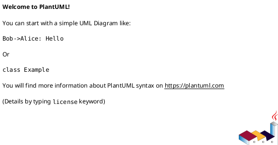
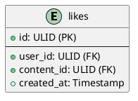
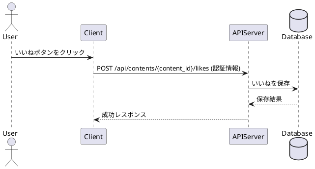

# Software Design Document

## 目標
このドキュメントの目的を記述します。

## 全体像
システムの全体的なアーキテクチャと主要なコンポーネントについて説明します。



## 詳細設計

### モジュールA
モジュールAの詳細な設計について記述します。

#### 機能1
機能1の説明


#### データ構造
関連するデータ構造について記述します。

### モジュールB
モジュールBの詳細な設計について記述します。

#### 機能1
機能1の説明


#### データ構造
関連するデータ構造について記述します。

## インターフェース設計
システム間のインターフェースについて記述します。

## データモデル
データの構造と関係について記述します。


## 非機能要件
パフォーマンス、セキュリティ、スケーラビリティなどの非機能要件について記述します。

## テスト計画
テスト戦略と主要なテストケースについて記述します。

## デプロイメント計画
システムのデプロイメント戦略について記述します。

## 考慮事項
セキュリティ、パフォーマンス、スケーラビリティなど、設計上の重要な考慮事項について記述します。

## 未解決の課題
未解決の課題や今後の検討事項について記述します。
## 実装タスク

### いいね機能実装タスク 📝

#### 機能概要
いいね機能の概要について説明します。ユーザーがコンテンツに対して「いいね」をつけたり、取り消したりできる機能です。

#### ユースケース
- 📝 ユーザーはコンテンツ詳細画面でいいねボタンをクリックすることで、そのコンテンツにいいねをつけることができる。
- 📝 ユーザーは既につけたいいねボタンを再度クリックすることで、いいねを取り消すことができる。
- 📝 ユーザーはコンテンツのいいね数を閲覧できる。
- 📝 ユーザーは自分がいいねしたコンテンツの一覧を閲覧できる（必要に応じて）。

#### 設計

##### API 設計
いいねの追加、削除、取得に関するAPIエンドポイントを定義します。

```
POST /api/contents/{content_id}/likes  // いいねを追加
DELETE /api/contents/{content_id}/likes // いいねを削除
GET /api/contents/{content_id}/likes/count // いいね数を取得
GET /api/users/{user_id}/likes // ユーザーがいいねしたコンテンツ一覧を取得（必要に応じて）
```

##### データモデル
いいねに関するデータモデルを定義します。



##### シーケンス図
いいねを追加する際のシーケンス図の例を示します。



#### 技術的詳細
- 📝 データベース: いいね情報は `likes` テーブルに保存します。
- 📝 キャッシュ: いいね数を高頻度で参照する場合は、キャッシュの導入を検討します。
- 📝 パフォーマンス: いいねの追加・削除処理は高速に実行される必要があります。
