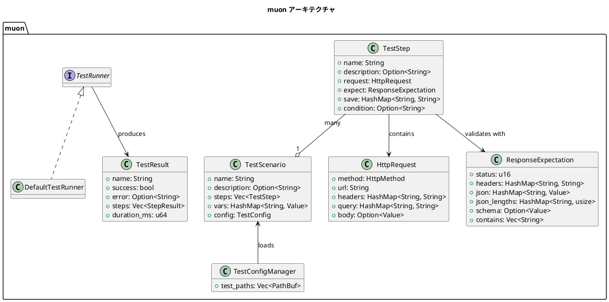

# muon: APIテスト宣言的記述フレームワーク

2024/07/05

muonは、APIテストを宣言的に記述するためのRust製フレームワークです。YAMLベースのテスト記述で、簡単かつ効率的にAPIテストを実装できます。

## 概要

muonは以下の機能を提供します：

- YAMLによる宣言的なテスト記述
- HTTPリクエストとレスポンス検証
- 変数の保存と再利用
- JSONレスポンスの検証
- 条件付きテスト実行
- テスト結果の詳細レポート



## 使用方法

### テスト定義ファイル

テストは`.yaml`または`.yml`ファイルで定義します。テストファイルは以下の構造を持ちます：

```yaml
name: テストシナリオ名
description: テストシナリオの説明

config:
  base_url: http://localhost:3000
  headers:
    Authorization: Bearer token
    Content-Type: application/json
  timeout: 30
  continue_on_failure: false

vars:
  variable_name: initial_value

steps:
  - name: ステップ1
    description: 最初のリクエスト
    request:
      method: GET
      url: "{{ base_url }}/api/resource"
      headers:
        X-Custom-Header: custom-value
    expect:
      status: 200
      json:
        result.status: "success"
      contains:
        - "expected text"
    save:
      saved_id: result.id

  - name: ステップ2
    description: 2番目のリクエスト
    request:
      method: POST
      url: "{{ base_url }}/api/resource/{{ saved_id }}"
      body:
        name: "Test Name"
        value: 123
    expect:
      status: 201
```

### 変数展開

`{{ variable_name }}`の形式で、以下の場所で変数展開が可能です：

- URL
- リクエストヘッダー
- リクエストボディ（JSON内）
- 期待値

### レスポンス検証

`expect`セクションでレスポンスを検証できます：

- `status`: 期待するHTTPステータスコード
- `headers`: 期待するHTTPヘッダー
- `json`: JSONパスと期待値のマッピング
- `json_lengths`: JSONパスに存在する配列/オブジェクトの要素数
- `contains`: レスポンスボディに含まれるべきテキスト

### 変数の保存

`save`セクションで、レスポンスから変数を抽出して保存できます：

```yaml
save:
  variable_name: json.path.to.value
```

### テスト実行エントリポイント

以下のようなRustコードでテストを実行します：

```rust
use anyhow::Result;
use muon::{DefaultTestRunner, TestConfigManager, TestRunner};

#[tokio::test]
async fn run_api_scenarios() -> Result<()> {
    // テスト設定マネージャーの作成
    let mut config = TestConfigManager::new();

    // テストシナリオディレクトリの設定
    config.add_path("tests/scenarios");

    // テストケースのロード
    let scenarios = config.load_all_scenarios()?;
    if scenarios.is_empty() {
        println!("テストシナリオが見つかりません。");
        return Ok(());
    }

    // テストランナーの作成と実行
    let runner = DefaultTestRunner::new();
    for scenario in scenarios {
        match runner.run(&scenario).await {
            Ok(result) => {
                if !result.success {
                    panic!("テスト失敗: {}", scenario.name);
                }
            }
            Err(e) => {
                panic!("テスト実行エラー: {}", e);
            }
        }
    }

    Ok(())
}
```

## テストシナリオの例

```yaml
name: ユーザーAPI テストシナリオ
description: ユーザーAPIのCRUD操作テスト

config:
  base_url: http://localhost:3000
  headers:
    Authorization: Bearer test-token
    Content-Type: application/json

steps:
  - name: ユーザー作成
    request:
      method: POST
      url: "{{ base_url }}/api/users"
      body:
        name: "Test User"
        email: "test@example.com"
    expect:
      status: 201
      json:
        name: "Test User"
      json_lengths:
        roles: 2
    save:
      user_id: id

  - name: ユーザー取得
    request:
      method: GET
      url: "{{ base_url }}/api/users/{{ user_id }}"
    expect:
      status: 200
      json:
        id: "{{ user_id }}"
        name: "Test User"

  - name: ユーザー更新
    request:
      method: PUT
      url: "{{ base_url }}/api/users/{{ user_id }}"
      body:
        name: "Updated User"
    expect:
      status: 200
      json:
        name: "Updated User"

  - name: ユーザー削除
    request:
      method: DELETE
      url: "{{ base_url }}/api/users/{{ user_id }}"
    expect:
      status: 204
```

## モデル構造

muonパッケージには以下の主要なモデルが含まれています：

- `TestScenario`: テストシナリオ全体を表す
- `TestStep`: 個々のテストステップを表す
- `HttpRequest`: HTTPリクエストの詳細
- `ResponseExpectation`: 期待されるレスポンス
- `TestResult`: テスト実行結果

## クリーンな失敗

muonは、テストが失敗した場合に明確なエラーメッセージと詳細な情報を提供します：

- 期待されるステータスコードと実際のステータスコード
- 期待されるJSONパスの値と実際の値
- 期待されるテキストとレスポンスボディ
- 詳細な各ステップの実行結果

## 拡張ポイント

muonは`TestRunner`トレイトを実装することで拡張できます：

```rust
#[async_trait]
pub trait TestRunner: Send + Sync {
    /// テストシナリオを実行する
    async fn run(&self, scenario: &TestScenario) -> Result<TestResult>;
}
```

独自のテスト実行ロジックやカスタム検証を追加したい場合は、このトレイトを実装した独自の構造体を作成できます。 
