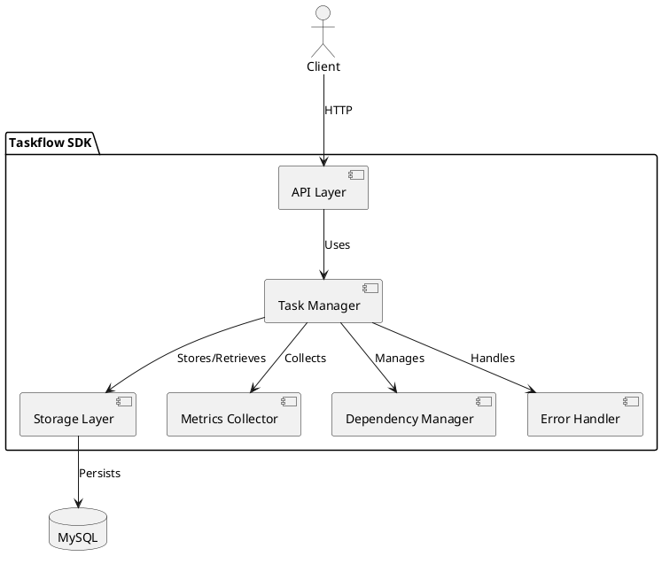

# Taskflow SDK

非同期タスクを管理・監視するためのSDKです。

## 概要

Taskflow SDKは、非同期タスクの実行と管理を簡単に行うためのツールを提供します。
主な特徴は以下の通りです：

- 非同期タスクの実行と状態管理
- タスク間の依存関係の制御
- 詳細なメトリクス収集
- エラーハンドリングとリトライ機能
- MySQLを使用した永続化
- OpenAPI (Swagger) 準拠のREST API

## アーキテクチャ



## 機能詳細

### 基本機能

#### タスクの状態管理
タスクは以下の状態を持ちます：

- `Created`: タスクが作成された初期状態
- `InProgress`: タスクが実行中
- `Completed`: タスクが正常に完了
- `Failed`: タスクが失敗
- `Cancelled`: タスクがキャンセルされた

#### メタデータ管理
各タスクには以下のメタデータを付与できます：

- タスク名
- 優先度
- カスタムデータ（JSON形式）
- 進捗情報
- タイムスタンプ（作成日時、更新日時、完了日時）

### タスク間の依存関係

#### 依存関係の種類

1. **Sequential（順次実行）**
   - 前のタスクが完了してから次のタスクを実行
   - 最も基本的な依存関係

2. **OnSuccess（成功時実行）**（実装予定）
   - 前のタスクが成功した場合のみ次のタスクを実行
   - エラーハンドリングと組み合わせて使用

3. **OnFailure（失敗時実行）**（実装予定）
   - 前のタスクが失敗した場合のみ次のタスクを実行
   - エラーリカバリ��フローの実装に使用

4. **Parallel（並列実行）**（実装予定）
   - 複数のタスクを同時に実行
   - 依存関係のないタスク間で使用

#### 循環依存の検出
- タスク間の依存関係が循環しないようにチェック
- 循環依存が検出された場合はエラーを返す

### メトリクス収集

#### タスク実行メトリクス
- 実行時間の計測
- 成功/失敗の回数
- リトライ回数
- タスクの状態遷移

#### ストレージメトリクス
- クエリ実行時間
- データベース接続数
- トランザクション成功率
- デッドロック発生回数

### ストレージ

#### MySQL実装
- タスク情報の永続化
- トランザクションサポート
- インデックス最適化
- コネクションプール管理

#### インメモリストレージ
- テスト用の軽量実装
- 永続化なしで高速に動作
- ユニットテストで使用

## 使用例

### 基本的な使用方法

```rust
let taskflow = Taskflow::new(TaskflowConfig::new(database_url)).await?;

let task = taskflow.execute_async(
    "example_task",
    |ctx| async move {
        // タスクの処理
        ctx.update_metadata(json!({ "progress": 50 })).await?;
        Ok(())
    },
    Some(json!({ "priority": "high" })),
);
```

### タスクの依存関係の設定

```rust
// タスク1の完了後にタスク2を実行
taskflow.add_task_dependency(&task1.id, &task2.id, DependencyType::Sequential).await?;

// タスク2の完了後にタスク3を実行
taskflow.add_task_dependency(&task2.id, &task3.id, DependencyType::Sequential).await?;
```

### タスクのキャンセル

```rust
taskflow.cancel_task(&task.id, "User requested cancellation").await?;
```

### タスクの状態監視

```rust
loop {
    let status = taskflow.get_task_status(&task.id).await?;
    if let Some(status) = status {
        println!("Task status: {:?}", status);
        if status.is_finished() {
            break;
        }
    }
    tokio::time::sleep(Duration::from_secs(1)).await;
}
```

## データベーススキーマ

```sql
CREATE TABLE tasks (
    id VARCHAR(64) PRIMARY KEY,      -- task_01jfky0m03c62grajp02z03abc
    name VARCHAR(255) NOT NULL,      -- タスク名
    status VARCHAR(32) NOT NULL,     -- Created, InProgress, Completed, Failed, Cancelled
    created_at TIMESTAMP NOT NULL DEFAULT CURRENT_TIMESTAMP,
    updated_at TIMESTAMP NOT NULL DEFAULT CURRENT_TIMESTAMP ON UPDATE CURRENT_TIMESTAMP,
    completed_at TIMESTAMP NULL,
    error_message TEXT NULL,
    metadata JSON NULL,              -- カスタムメタデータ
    INDEX idx_status_created (status, created_at),
    INDEX idx_updated (updated_at)
) ENGINE = InnoDB DEFAULT CHARSET = utf8mb4;

CREATE TABLE task_dependencies (
    id VARCHAR(64) PRIMARY KEY,
    source_task_id VARCHAR(64) NOT NULL,
    target_task_id VARCHAR(64) NOT NULL,
    dependency_type VARCHAR(32) NOT NULL,  -- Sequential, OnSuccess, OnFailure
    created_at TIMESTAMP NOT NULL DEFAULT CURRENT_TIMESTAMP,
    FOREIGN KEY (source_task_id) REFERENCES tasks(id),
    FOREIGN KEY (target_task_id) REFERENCES tasks(id),
    INDEX idx_source_task (source_task_id),
    INDEX idx_target_task (target_task_id)
) ENGINE = InnoDB DEFAULT CHARSET = utf8mb4;
```

## 実装状況

### 🔄 Web API（最優先）
- 📝 utoipaを使用したREST APIの実装
  - OpenAPI (Swagger) ドキュメントの自動生成
  - タスク管理API
    - タスクの作成
    - タスクの状態取得
    - タスク一覧の取得
    - タスクの更新
    - タスクの削除
  - 依存関係管理API
    - 依存関係の追加
    - 依存関係の削除
  - メトリクスAPI
    - タスクメトリクスの取得
    - ストレージメトリクスの取得

### ✅ 基本機能
- ✅ タスクの作成と実行
- ✅ タスクの状態管理
- ✅ メタデータ管理
- ✅ 進捗状況の追跡

### ✅ タスク間の依存関係
- ✅ 順次実行（Sequential）
- 📝 条件付き実行（OnSuccess）
- 📝 条件付き実行（OnFailure）
- 📝 並列実行（Parallel）

### ✅ メトリクス収集
- ✅ タスクの実行時間
- ✅ 成功/失敗率
- ✅ リトライ回数
- ✅ データベースのパフォーマンス指標

### 🔄 エラーハンドリング
- ✅ 基本的なエラーハンドリング
- 📝 カスタムエラーハンドラー
- 📝 エラー通知の仕組み
- 📝 リトライ戦略のカスタマイズ

### 📝 その他の機能
- 📝 タスクのグループ化
- 📝 タスクのスケジューリング
- 📝 タスクの優先順位付け
- 📝 タスクの一時停止/再開
- 📝 分散環境でのタスク管理

## API仕様（予定）

### タスク管理API

```rust
/// タスク作成リクエスト
#[derive(ToSchema)]
struct CreateTaskRequest {
    name: String,
    metadata: Option<JsonValue>,
}

/// タスク作成レスポンス
#[derive(ToSchema)]
struct CreateTaskResponse {
    task_id: TaskId,
    status: AsyncStatus,
}

/// タスク一覧取得レスポンス
#[derive(ToSchema)]
struct ListTasksResponse {
    tasks: Vec<TaskInfo>,
    total: u64,
}

/// タスク情報
#[derive(ToSchema)]
struct TaskInfo {
    id: TaskId,
    name: String,
    status: AsyncStatus,
    created_at: DateTime<Utc>,
    updated_at: DateTime<Utc>,
    completed_at: Option<DateTime<Utc>>,
    metadata: Option<JsonValue>,
}

#[utoipa::path(
    post,
    path = "/api/v1/tasks",
    request_body = CreateTaskRequest,
    responses(
        (status = 201, description = "Task created successfully", body = CreateTaskResponse),
        (status = 400, description = "Invalid request"),
        (status = 500, description = "Internal server error")
    )
)]
async fn create_task(
    State(state): State<AppState>,
    Json(payload): Json<CreateTaskRequest>,
) -> Result<Json<CreateTaskResponse>, ApiError> {
    // 実装予定
}

#[utoipa::path(
    get,
    path = "/api/v1/tasks/{task_id}",
    responses(
        (status = 200, description = "Task found", body = TaskInfo),
        (status = 404, description = "Task not found"),
        (status = 500, description = "Internal server error")
    )
)]
async fn get_task(
    State(state): State<AppState>,
    Path(task_id): Path<TaskId>,
) -> Result<Json<TaskInfo>, ApiError> {
    // 実装予定
}
```

### メトリクスAPI

```rust
/// メトリクスレスポンス
#[derive(ToSchema)]
struct MetricsResponse {
    task_metrics: TaskMetrics,
    storage_metrics: DatabaseMetrics,
}

#[utoipa::path(
    get,
    path = "/api/v1/metrics",
    responses(
        (status = 200, description = "Metrics retrieved successfully", body = MetricsResponse),
        (status = 500, description = "Internal server error")
    )
)]
async fn get_metrics(
    State(state): State<AppState>,
) -> Result<Json<MetricsResponse>, ApiError> {
    // 実装予定
}
```

## エラー型

```rust
pub enum TaskflowError {
    /// データベース関連のエラー
    DatabaseError(String),
    
    /// タスクが見つからない
    TaskNotFound(String),
    
    /// タスクの実行中のエラー
    ExecutionError(String),
    
    /// 設定関連のエラー
    ConfigError(String),
    
    /// 依存関係のエラー（循環依存など）
    DependencyError(String),
    
    /// シリアライズ/デシリアライズのエラー
    SerializationError(String),
}
```

## パフォーマンスに関する考慮事項

### コネクションプール設定

```rust
let pool = MySqlPoolOptions::new()
    .max_connections(32)
    .min_connections(5)
    .acquire_timeout(Duration::from_secs(30))
    .idle_timeout(Duration::from_secs(600))
    .max_lifetime(Duration::from_secs(1800))
    .connect(&database_url)
    .await?;
```

### インデックス最適化

- `idx_status_created`: タスクのステータスと作成日時による検索を最適化
- `idx_updated`: 更新日時でのソートを最適化
- `idx_source_task`と`idx_target_task`: 依存関係の検索を最適化

### バッチ処理

- 複数タスクの一括作成/更新をサポート
- トランザクションを使用した整合性の保証
- バルクインサート/アップデートの最適化